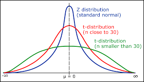

# Probability Distributions


# T-distribution


# [Qn1](https://towardsdatascience.com/40-statistics-interview-problems-and-answers-for-data-scientists-6971a02b7eee)
Infection rates at a hospital above a 1 infection per 100 person-days at risk are considered high. A hospital had 10 infections over the last 1787 person-days at risk. Give the p-value of the correct one-sided test of whether the hospital is below the standard.

```python
from scipy.stats import poisson

"""
pmf of poisson f(k,lam) =  e^-lam  lam^k
                           --------------
						       k!
mean = variance = lam
std = sqrt(variance)
"""

k = 10
mu = 1/100 * 1787

pval = poisson.cdf(k,mu) # 0.0323

```

# Qn2
You roll a biased coin (p(head)=0.8) five times. What’s the probability of getting three or more heads?

```python
"""

P(p,r) = nCr  p^r q^(1-r)

nCr = n! / (r! (n-r)!)

P(3 or more heads) = P(3 heads) + P(4 heads) + P(5 heads)
"""

p = 0.8
n = 5
k = 3,4,5


```
