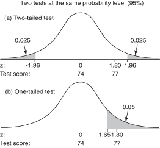
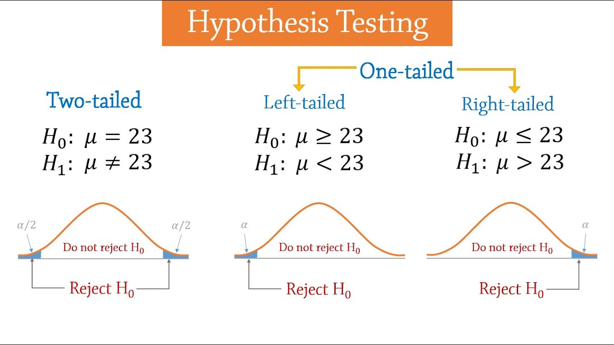

# Blogs and Talks
- [Good: Understanding Maximum Likelihood](https://rpsychologist.com/d3/likelihood/)
- [Good: tutorialspoint Statistics - One Proportion Z Test](https://www.c.com/statistics/one_proportion_z_test.htm)
- [Jake VanDerPlas for PyCon 2016: Statistics for Hackers](https://nbviewer.jupyter.org/github/croach/statistics-for-hackers/blob/master/statistics-for-hackers.ipynb)
 - [Frequentists AB test](http://ethen8181.github.io/machine-learning/ab_tests/frequentist_ab_test.html)
 - [Data8: A/B Testing](https://www.inferentialthinking.com/chapters/12/1/AB_Testing.html)

# Important Links
- [Rshiny app online with 28 distributions plots and multiple language codes](https://ben18785.shinyapps.io/distribution-zoo/)
- [Fourier wave transformation youtube](https://www.youtube.com/watch?v=r18Gi8lSkfM)
- [29 statistical concepts](https://www.datasciencecentral.com/profiles/blogs/29-statistical-concepts-explained-in-simple-english-part-16)

# Statistics Books
- [ESL The Elements of Statistical Learning by  Friedman, Hastie, and Tibshirani](https://web.stanford.edu/~hastie/ElemStatLearn/)
- [ISL An Introduction to Statistical Learning: With Applications in R by  Friedman, Hastie, and Tibshirani](http://www-bcf.usc.edu/~gareth/ISL/)
- [Why Dividing By N Underestimates the Variance youtube](https://www.youtube.com/watch?v=sHRBg6BhKjI)

# Probability and Statistics Links
- [Interactive Concepts brown.edu: Seeing Theory](https://lnkd.in/etgzUv7)

# Fitting lognormal distribution
```python
import numpy as np
import scipy.stats as stats
import matplotlib.pyplot as plt

# look distribution here: https://ben18785.shinyapps.io/distribution-zoo/
# for lognorm scale = exp(mu) and s=sigma
sample = stats.lognorm.rvs(loc=0, s=1, size=1000, random_state=0)

# plot sample
x_axis = np.linspace(0,10,1000)

plt.figure(figsize=(12,8))
plt.plot(x_axis, sample,'b.',label='Orignal data')
#plt.hist(sample);

# fit lognormal
params = stats.lognorm.fit(sample, floc=0)
y_axis = stats.lognorm.pdf(x_axis, *params)

# plot
plt.title('Fitted Lognormal')
plt.plot(x_axis, y_axis,label='Fitted Lognormal')
plt.legend()
plt.show()
```

# T-test and KS(Kolmogorov-Smirnov) test for one sample
https://docs.scipy.org/doc/scipy/reference/tutorial/stats.html
(Scroll down pages to T-test and KS test)


# p-values
```python
from functools import partial
import scipy.stats as stats

def compare(x, y, func):
    """Returne p-value for some appropriate comparison test."""
    return func(x, y)[1]

x, y = np.random.normal(0, 1, (100,2)).T

print ("p value assuming equal variance    =%.8f" % compare(x, y, stats.ttest_ind))

test = partial(stats.ttest_ind, equal_var=False)
print ("p value not assuming equal variance=%.8f" % compare(x, y, test))
```

# Hypothesis Testing
https://www.statisticshowto.datasciencecentral.com/probability-and-statistics/hypothesis-testing/

NOTE:    
  1. There is some established theory. Think H0, alpha, and statistic of alpha (one or two tailed) (z-score, t-score etc)
  2. Researcher wants to test his new idea. Think H1, test-statistic.
  3. If researchers test-statistic > established statistic, Then researcher is happy, his assumption is statistically significant.

## One tailed z-test
A principal at a certain school claims that the students in his school are above average intelligence. A random sample of thirty students IQ scores have a mean score of 112. Is there sufficient evidence to support the principal’s claim? The mean population IQ is 100 with a standard deviation of 15.

Step 1: State the Null hypothesis. The accepted fact is that the population mean is 100, so: H0: μ=100.

Step 2: State the Alternate Hypothesis. The claim is that the students have above average IQ scores, so:
H1: μ > 100.
The fact that we are looking for scores “greater than” a certain point means that this is a one-tailed test.

Step 3: Draw a picture to help you visualize the problem.



Step 4: State the alpha level. If you aren’t given an alpha level, use 5% (0.05).

Step 5: Find the rejection region area (given by your alpha level above) from the z-table. An area of .05 is equal to a z-score of 1.645.

Step 6: Find the test statistic using this formula: z score formula
For this set of data: z= (112.5-100) / (15/√30)=4.56.

Step 6: If Step 6 is greater than Step 5, reject the null hypothesis. If it’s less than Step 5, you cannot reject the null hypothesis. In this case, it is greater (4.56 > 1.645), so you can reject the null. Rejecting null means we can say alternative is true. This means principle's claim is statistically supported with 5 % level of confidence.

## Two-tailed z-test

Blood glucose levels for obese patients have a mean of 100 with a standard deviation of 15. A researcher thinks that a diet high in raw cornstarch will have a positive or negative effect on blood glucose levels. A sample of 30 patients who have tried the raw cornstarch diet have a mean glucose level of 140. Test the hypothesis that the raw cornstarch had an effect:

Step 1: State the null hypothesis: H0:μ=100

Step 2: State the alternate hypothesis: H1:≠100

Step 3: State your alpha level. We’ll use 0.05 for this example. As this is a two-tailed test, split the alpha into two.
0.05/2=0.025

Step 4: Find the z-score associated with your alpha level. You’re looking for the area in one tail only. A z-score for 0.75(1-0.025=0.975) is 1.96. As this is a two-tailed test, you would also be considering the left tail (z=1.96)

Step 5: Find the test statistic using this formula: z score formula
z=(140-100)/(15/√30)=14.60.

Step 6: If Step 5 is less than -1.96 or greater than 1.96 (Step 3), reject the null hypothesis. In this case, it is greater, so you can reject the null. Rejecting null hypothesis means accepting alternative hypothesis. This means the raw starch has some effects on patients.

