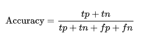
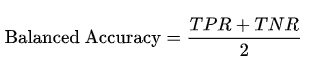
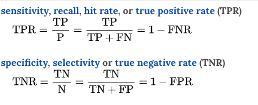
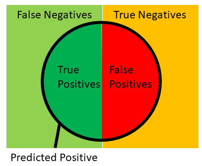
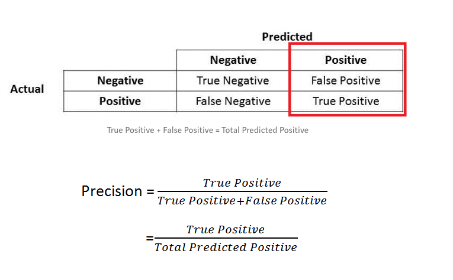
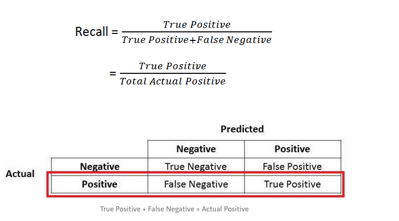
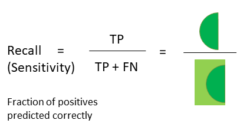
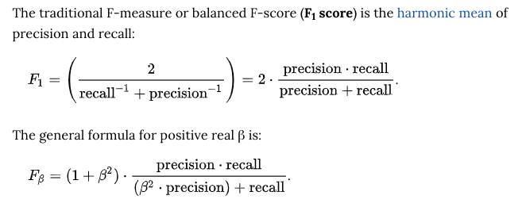

Table of Contents
=================
   * [Accuracy and balanced accuracy](#accuracy-and-balanced-accuracy)
   * [Precision](#precision)
   * [Recall](#recall)
   * [F-beta score](#f-beta-score)

# Accuracy and balanced accuracy

# Precision

- Precision is all P.
- How many selected items are GOOD?
- Precision is important metric when FP is important. For example, spam email detection.
  When an non-spam email is predicted as spam, it is bad.

# Recall

- Recall has FN instead of FP.
- How frauds are selected?
- Recall is important when FN is important.
- For example, in fraud detection. When fraud is deteced non-fraud it is bad.
- Another example is patient sickness detection and terrorist detection.

# F-beta score

- when beta is 1, both precision and recall has weights 1.
- F1 score tries to balance both precision and recall.
- In practical life, either precision or recall is much more important than another.

