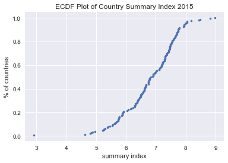

# ECDF Links
- [Datacamp Statistical Thinking ECDF Video-Intro ](https://campus.datacamp.com/courses/statistical-thinking-in-python-part-1/graphical-exploratory-data-analysis?ex=11)

# Code
```python
import numpy as np

def ecdf(data):
    x = np.sort(data) # sorted x-axis
    y = np.arange(1,len(data)+1)/len(data) # 0 to 1
    return x, y

#Create ECDF for Country Summary Index in 2015
x2015,y2015=ecdf(df['Summary Index'][df.Year==2015])
plt.plot(x2015,y2015, marker='.', linestyle='none')
plt.title('ECDF Plot of Country Summary Index 2015')
plt.xlabel('summary index')
plt.ylabel('% of countries')
plt.legend()
plt.show()
```


