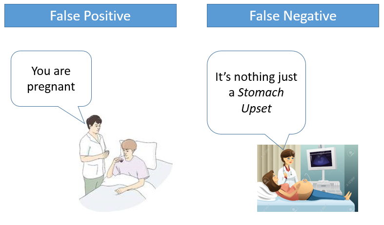

# False Positives and False Negatives

1. What are False Positives and False Negatives
 False Positives are the cases where you wrongly classified a non-event as an event a.k.a Type I error.

  And, False Negatives are the cases where you wrongly classify events as non-events, a.k.a Type II error.

 

 In medical field, assume you have to give chemo therapy to patients. Your lab tests patients for certain vital information and based on those results they decide to give radiation therapy to a patient.

 Assume a patient comes to that hospital and he is tested positive for cancer (But he doesn’t have cancer) based on lab prediction. What will happen to him? (Assuming Sensitivity is 1)

 One more example might come from marketing. Let’s say an ecommerce company decided to give `$1000` Gift voucher to the customers whom they assume to purchase at least `$5000` worth of items. They send free voucher mail directly to 100 customers without any minimum purchase condition because they assume to make at least `20%` profit on sold items above `5K`.

 Now what if they have sent it to false positive cases? 

1. Can you cite some examples where a false negative important than a false positive?

 Assume there is an airport ‘A’ which has received high security threats and based on certain characteristics they identify whether a particular passenger can be a threat or not. Due to shortage of staff they decided to scan passenger being predicted as risk positives by their predictive model.

 What will happen if a true threat customer is being flagged as non-threat by airport model?

  Another example can be judicial system. What if Jury or judge decide to make a criminal go free?

  What if you rejected to marry a very good person based on your predictive model and you happen to meet him/her after few years and realize that you had a false negative?

1. Can you cite some examples where both false positive and false negatives are equally important?

 In the banking industry giving loans is the primary source of making money but at the same time if your repayment rate is not good you will not make any profit, rather you will risk huge losses.

 Banks don’t want to lose good customers and at the same point of time they don’t want to acquire bad customers. In this scenario both the false positives and false negatives become very important to measure.

 These days we hear many cases of players using steroids during sport competitions Every player has to go through a steroid test before the game starts. A false positive can ruin the career of a Great sportsman and a false negative can make the game unfair.
