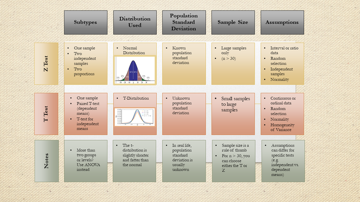

# Good links
- [hypothesis-testing-spinning-the-wheel](https://nikolanews.com/statistical-hypothesis-testing-spinning-the-wheel/)





# z-test for coin toss
```
 Let's suppose that after n=100 flips, we get h=61 heads. 
 We choose a significance level of 0.05: is the coin fair or not? 
 Our null hypothesis is: the coin is fair (q=1/2).
 H0 : a coin is a fair coin.
 H1 : a coin is a tricky coin.
 alpha = 5% or 0.05
 
 
import numpy as np
import scipy.stats as st
import scipy.special as sp
n = 100  # number of coin flips
h = 61  # number of heads
q = .5  # null-hypothesis of fair coin

# find z-statistic
xbar = float(h) / n
z = (xbar - q) * np.sqrt(n / (q * (1 - q)))

# from the z-score, compute the p-value 
pval = 2 * (1 - st.norm.cdf(z))
pval # 0.0278

# decision
This p-value is less than 0.05, so we reject the null hypothesis and 
conclude that the coin is probably not fair.
```
After doing the test, our p-vaule lies outer than 5% critical region (darkblue,) and p-value (prob value) does
not lie inside 95% region, so our probability is not reliable under 5% significance.

