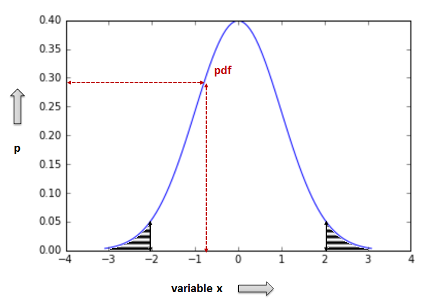
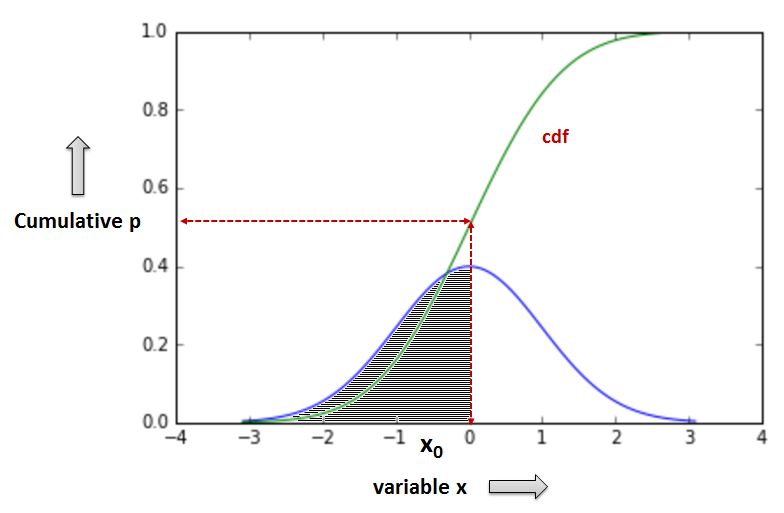
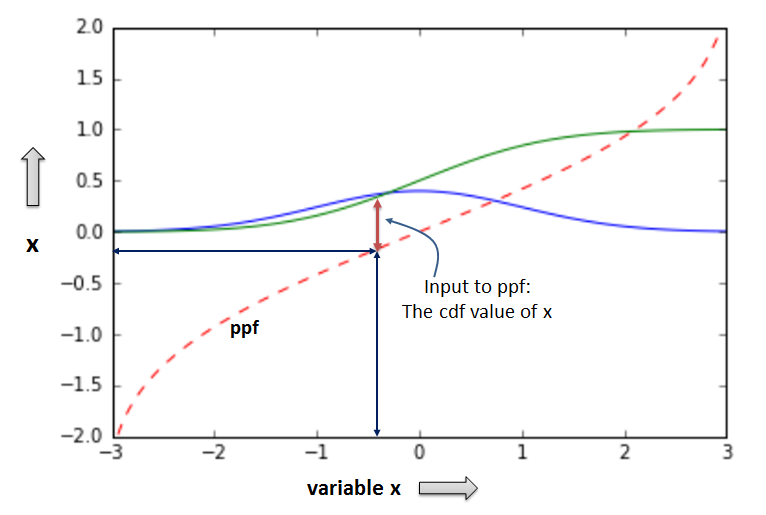
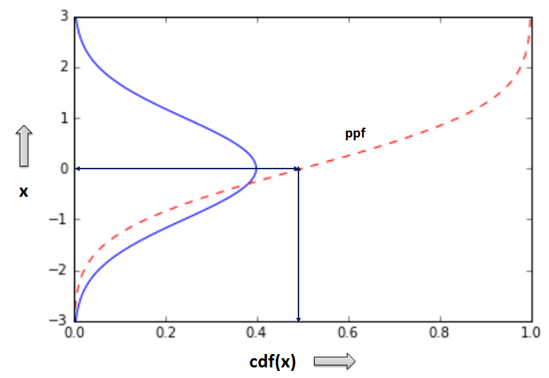
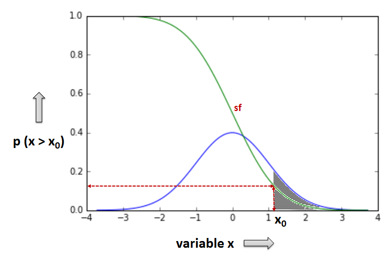

Distributions[¶](#Distributions)
================================

* As explained a **distribution** of a variable is _an expression of the probability that when measuring the variable the result will lie within a specific range of values_.
* Depending on how the variable varies, distribution can be either:
    
    > * **Discrete**
    >     
    >     > * The variable can take only **specific countable levels of values** (is a 'quantized' variable)
    >     > * Example: when throwing a dice the outcome is a discrete (quantized) variable: it can only take six values. The probability distribution (for a fair dice) is constant: 1/6
    >     > * Scipy.stats documentation on [discrete statistical distributions](http://docs.scipy.org/doc/scipy/reference/tutorial/stats/discrete.html#discrete-statistical-distributions)
    >     
    > * **Continuous**
    >     
    >     > * The variable can take **any value ('varies continuously')** between a minimum and a maximum value. The probability distribution varies accordingly and is usually described by some **mathematical expression**
    >     > * Example: when measuring each individual's height in a group of people the variable 'height' varies between a minimum and a maximum value; there are no preset levels for this variable.
    >     > * Scipy.stats documentation on [continuous statistical distributions](http://docs.scipy.org/doc/scipy/reference/tutorial/stats/continuous.html#continuous-statistical-distributions)
    >     
    

Main methods for a continuous distribution[¶](#Main-methods-for-a-continuous-distribution)
------------------------------------------------------------------------------------------

* Before starting code work with distributions I explain some important concepts implemented as **scipy.stats methods/functions** to help understand how distributions work.
* We focus on _continuous univariate_ ('of one variable') distributions but much of what is presented is valid also for discrete distributions.

* _pdf_: Probability Density Function
* _cdf_: Cumulative Distribution Function
* _ppf_: Percent Point Function (Inverse of cdf)
* _sf_: Survival Function (1-cdf)
* _isf_: Inverse Survival Function (Inverse of sf)

These are important methods to work with and you should gradually get familiar with them if you are serious with computational statistics. Below we concisely explain the meaning and operation of them. Coding examples are given in next sections discussing specific distributions.

#### pdf: probability density function[¶](#pdf:-probability-density-function)

* pdf returns the probability that the variable x takes a specific value (more correctly: lies between a range of values)

* Thus, given a certain value (or interval) of x, pdf returns the respective probability values. Observe, that p (y axis) increases and then decreases again as x gets greater values

#### Important: what is the probability of x being less/greater than a specific value[¶](#Important:-what-is-the-probability-of-x-being-less/greater-than-a-specific-value)

* The **area below the pdf curve** which is enclosed between two values x0 and xf represents the cumulative probability that x lies within this specific range of values
* For example, the greyed area on the right (in the pdf figure above) represents the probability that x is larger than 2 (lies in the interval (2, +inf). Respectively, the greyed area on the left represents the probability that x is less or equal to -2 (lies in (-inf, -2\])
* This notion is crucial in understanding hypothesis testing and we will come back later when discussing the meaning of hypothesis controls.

#### cdf: cumulative distribution function[¶](#cdf:-cumulative-distribution-function)

* Given a value x0 cdf returns the cumulative probability that x gets a value less or equal to x0, or in other words "lies in the interval (-inf, x0\]". Observe the cumulative p (y axis) values from 0 to 1 in the cdf graph below.

* In a normal distribution (as the one depicted in the above graph) cdf of the mean value returns 0.5 (more on normal distribution in the next section).

#### ppf: percent point function (or inverse cumulative distribution function)[¶](#ppf:-percent-point-function-(or-inverse-cumulative-distribution-function))

* ppf returns the value x of the variable that has a given cumulative distribution probability (cdf). Thus, given the cdf(x) of a x value, ppf returns the value x itself, therefore, operating as the inverse of cdf

 

* The graph on the left denotes that for a given x value the respective cdf(x) value is input to the ppf function, and ppf returns once again the original x value.
* The graph on the right is essentially the cdf graph above with inverse x and y axes. For a given cdf(x) (aka: cumulative p value) ppf returns the original x value.

#### sf: Survival function[¶](#sf:-Survival-function)

* sf returns the probability that the variate x gets a value that is greater than a specific value x0
* sf will be very useful in estimating statistical significance in hypothesis testing

* The greyed area in the graph above represents the probability that the variable x gets a value greater than the specific x0 value, or in other words: "lies in the interval (x0, +inf)"