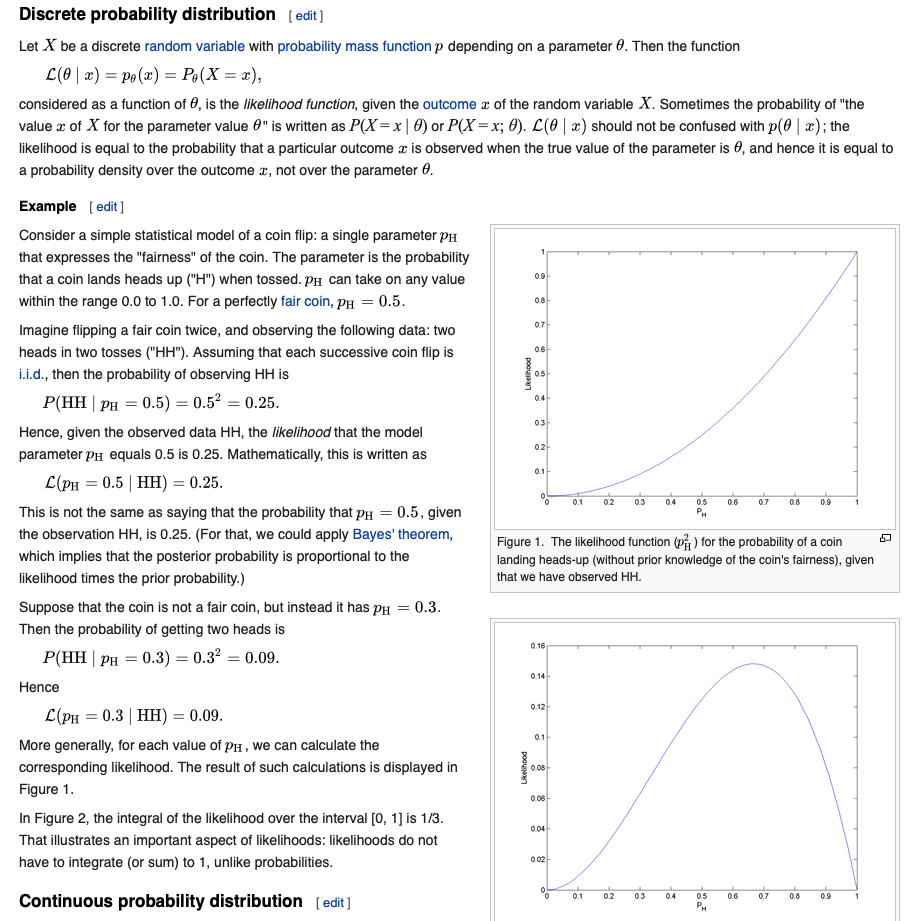
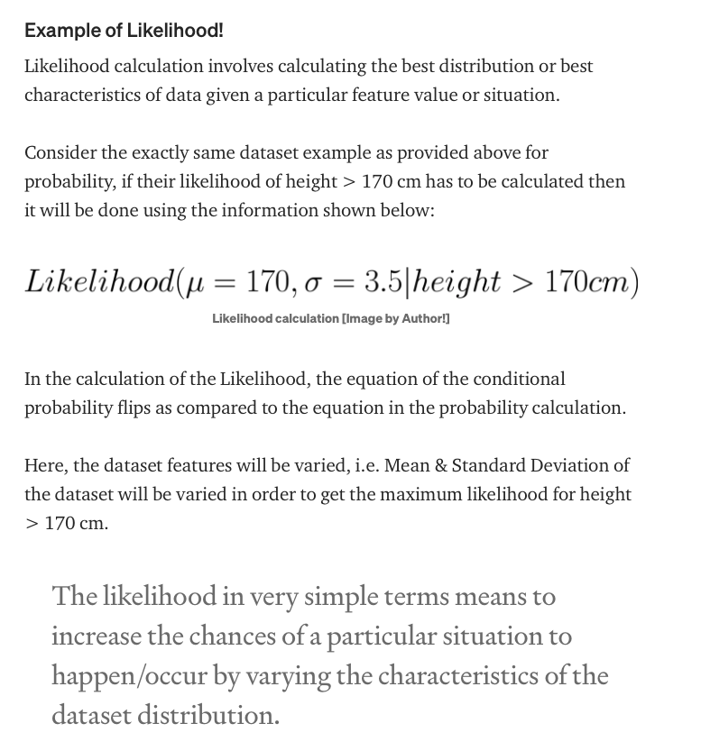
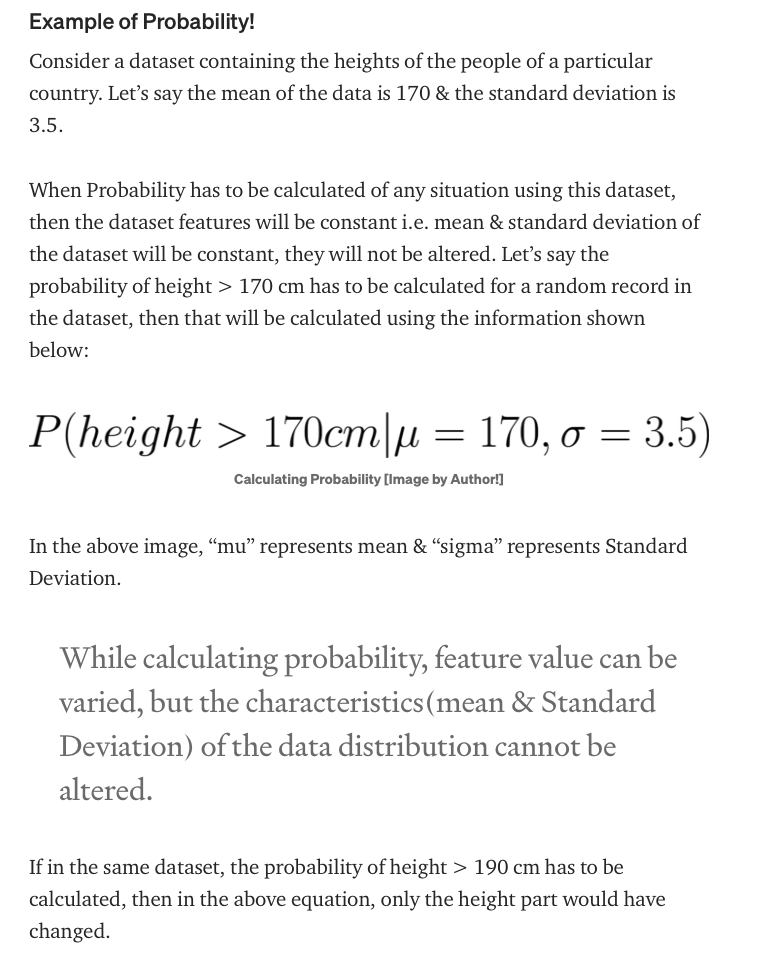
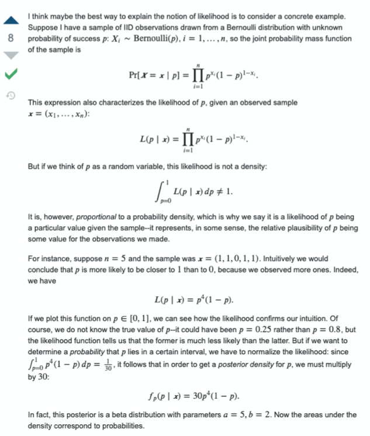

# Likelihood Function (or simply Likelihood)
- [wikipedia](https://en.wikipedia.org/wiki/Likelihood_function)

In statistics, the likelihood function (often simply called the likelihood) measures the goodness of fit of a statistical model to a sample of data for given values of the unknown parameters.

It is formed from the joint probability distribution of the sample, but viewed and used as a function of the parameters only, thus treating the random variables as fixed at the observed values.

**Likelihood for discrete case**:  
If X is discrete random variable with pmf p depending on parameter θ, then,

L(θ| x) = p_θ(x) = P_θ (X=x).

The likelihood is considered as a function of θ given the output x.

**Continuous case** is  
Let X be a random variable with pdf f depending on parameter θ, then,

L(θ| x) = f_θ(x)

For example, for Bernoulli distribution,
the joint prob function is:

P(X=x|p) = prod i=1 to n  p^xi  (1-p)^(1-xi)

If we characterized the likelihood as function of p, then,

L(p|x) = prod i=1 to n  p^xi  (1-p)^(1-xi)  (this is same as above)

We also note that,
total sum of prob = 1 but may not be for likelihood.

int_p=0_p=1 L(p|x) dp != 1

# Example of Likelihood function (coin flip)
- [wikipedia](https://en.wikipedia.org/wiki/Likelihood_function)

Let's say we have outcome of coin flip as HH.
Then, if we assume parameter of fairness p_H = 0.5, then,

likelihood function is,  
L(p_H=0.5 | HH) = 0.25

This means, given our outcome of HH, the likelihood that parameter p_H equals 0.5 is 0.25.

# Probability vs Likelihood

