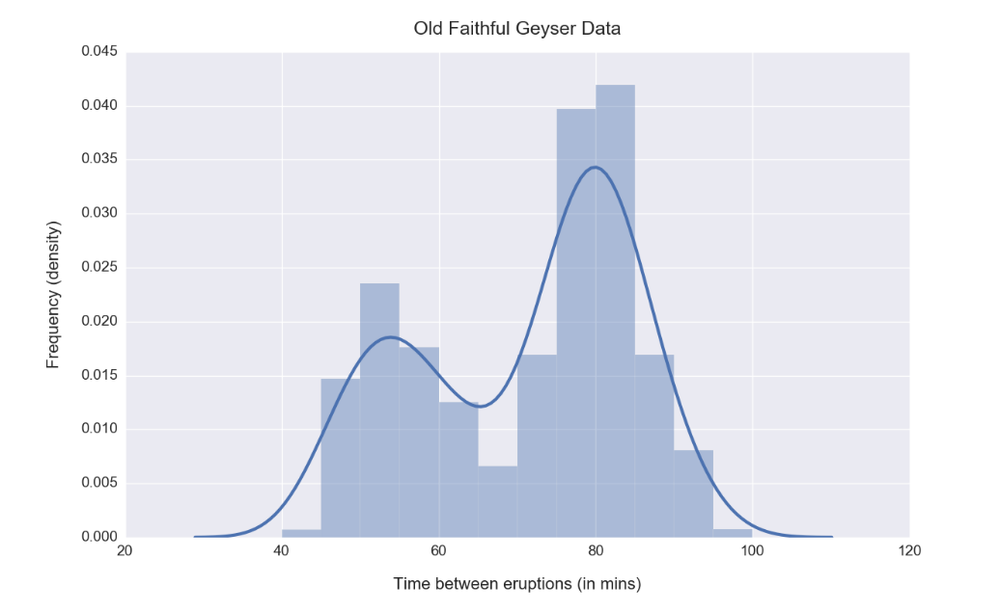

# Questions
- The mean heights of men and women in a population were calculated to be Mand W. What is the mean height of the total population?
- A recent poll revealed that a third of the cars in Italy are Ferraris, and that half of those are red. If you spot a red car approaching from a distance, what is the likelihood that it is a Ferrari?
- You’re trying to find the best place to put in an advertisement banner on your website. You can make the size (thickness) small, medium or large, and choose vertical position top, middle or bottom. At least how many total page visits (n) and ad clicks (m) do you need to say with 95% confidence that one of the designs performs better than all the other possibilities?
- The time period between consecutive eruptions of the Old Faithful geyser in Yellowstone National Park is found to have the following distribution. How would you describe/characterize it? What can you infer from it?

