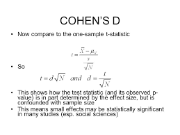

# Effect Sizes
- [Interpreting Cohen's d Effect Size](https://rpsychologist.com/cohend/)





# Cohens d
- [datacamp example](https://campus.datacamp.com/courses/experimental-design-in-python/sample-size-power-analysis-and-effect-size?ex=9)
```python
import numpy as np

def cohen_d(x,y):
    n1 = len(x)
    n2 = len(y)
    dof = n1 + n2 - 2
    diff = np.mean(x) - np.mean(y)
    #s_pooled = np.sqrt(((n1-1)*np.std(x, ddof=1) ** 2 + (n2-1)*np.std(y, ddof=1) ** 2) / dof)
    s_pooled = np.sqrt(((n1-1)*np.var(x, ddof=1) + (n2-1)*np.var(y, ddof=1)) / dof)
    cohens_d = diff / s_pooled
    return cohens_d

#dummy data
x = [2,4,7,3,7,35,8,9]
y = [i*2 for i in x]
# extra element so that two group sizes are not equal.
x.append(10)

# calculate d
d = cohen_d(x,y)
print(d) # -0.5720156046660209
```
