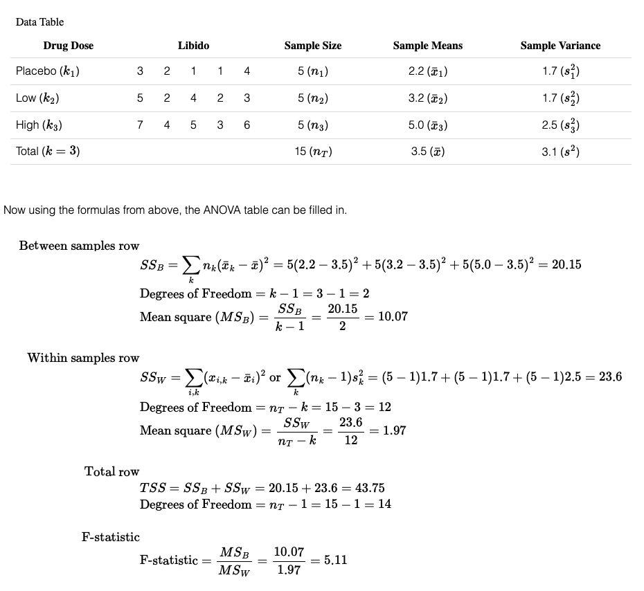

# Anova and others

Resources:
- [wikipedia one-way-anova](https://en.wikipedia.org/wiki/One-way_analysis_of_variance)
- [Excellent: ONE-WAY ANOVA (PYTHON FOR DATA SCIENCE) ](https://www.pythonfordatascience.org/anova-python/)

Notes:

ANOVA
- compare means of two (or usually more) groups using F-test.
- If only two groups, we can use t-test. (for two cases, F-test is equal to t-test).
- Usually three independent features are categorical and target y must be numerical.
- ANOVA is omnibus test, this means it only can say groups are different, but can not
  say which group is more important. For that, we need to use Post-hoc study.

- If data are ordinal, a non-parametric alternative to this test should be used such as Kruskal–Wallis one-way analysis of variance.

- If the variances are not known to be equal, a generalization of 2-sample Welch's t-test can be used.

- the two-way analysis of variance (ANOVA) is an extension of the one-way ANOVA that examines the influence of two different categorical independent variables on one continuous dependent variable. The two-way ANOVA not only aims at assessing the main effect of each independent variable but also if there is any interaction between them.


# What is the difference between a one-way and a two-way ANOVA?

The only difference between one-way and two-way ANOVA is the number of independent variables. A one-way ANOVA has one independent variable, while a two-way ANOVA has two.

One-way ANOVA: Testing the relationship between shoe brand (Nike, Adidas, Reebok,Asics) and race finish times in a marathon.
Two-way ANOVA: Testing the relationship between shoe brand (Nike, Adidas, Reebok, Asics), runner age group (junior, senior, master’s), and race finishing times in a marathon.
All ANOVAs are designed to test for differences among three or more groups. If you are only testing for a difference between two groups, use a t-test instead.

# Two Way ANOVA
A Two Way ANOVA is an extension of the One Way ANOVA. With a One Way, you have one independent variable affecting a dependent variable. With a Two Way ANOVA, there are two independents. Use a two way ANOVA when you have one measurement variable (i.e. a quantitative variable) and two nominal variables. In other words, if your experiment has a quantitative outcome and you have two categorical explanatory variables, a two way ANOVA is appropriate.

For example, you might want to find out if there is an interaction between income and gender for anxiety level at job interviews. The anxiety level is the outcome, or the variable that can be measured. Gender and Income are the two categorical variables. These categorical variables are also the independent variables, which are called factors in a Two Way ANOVA.

The factors can be split into levels. In the above example, income level could be split into three levels: low, middle and high income. Gender could be split into three levels: male, female, and transgender. Treatment groups are all possible combinations of the factors. In this example there would be 3 x 3 = 9 treatment groups.

# Assumptions of F-test (Anova test)
Parametric test assumptions

- Population distributions are normal
- Samples have equal variances
- Independence

# Anova calculation
```
H0: x1bar = x2bar = x3bar = ... = xkbar
H1: At least one of the group has different mean

F = MS_between / MS_within

MSB = SSB / (k-1)
MSW = SSW / (n-k)   # n is total number and k is number of groups.


if F-stat > F_critical:
   we reject H0

F-critical is obtained from table using given degree of freedom and alpha.
```

Let's say we have 3 types of doses `placebo`, `low` and `high` with each having
5 values for libido. We want to test is high dose better than low dose.


