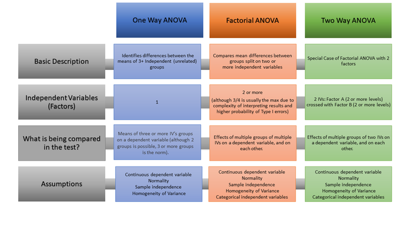

# Resources
- [https://www.marsja.se/four-ways-to-conduct-one-way-anovas-using-python/](https://www.marsja.se/four-ways-to-conduct-one-way-anovas-using-python/)
- [TowardsDS: Hypothesis testing in Machine learning using Python](https://towardsdatascience.com/hypothesis-testing-in-machine-learning-using-python-a0dc89e169ce)

