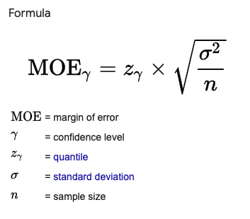

# Margin of Error


Note: z_gamma is 1.96 for two tailed test with 95% confidence level (or 5% significance level).

# Codes
```python
import numpy as np
from scipy import stats

# alpha to critical
alpha = 0.05
n_sided = 2 # 2-sided test
z_crit = stats.norm.ppf(1-alpha/n_sided)
print(z_crit) # 1.959963984540054

# critical to alpha
alpha = stats.norm.sf(z_crit) * n_sided
print(alpha) # 0.05
```