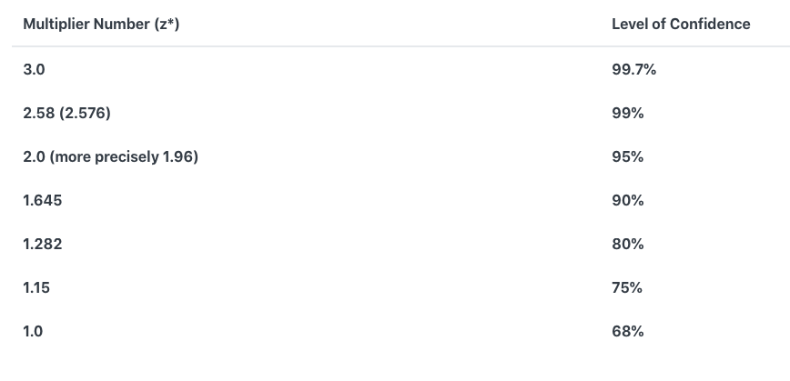
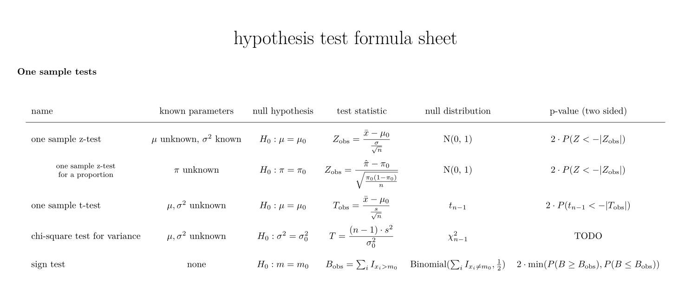

Table of Contents
=================
   * [Resources](#resources)
   * [Hypothesis testing](#hypothesis-testing)
   * [Type-I and Type-II errors and FP FN](#type-i-and-type-ii-errors-and-fp-fn)
   * [Normal distribution](#normal-distribution)
   * [P-value](#p-value)
   * [H0 and H1](#h0-and-h1)
   * [Standard Error](#standard-error)
   * [Margin of Error](#margin-of-error)
   * [Pooled standard deviation and t-statistic](#pooled-standard-deviation-and-t-statistic)
   * [F-test or ANOVA](#f-test-or-anova)
   * [When to use Z-test and T-test](#when-to-use-z-test-and-t-test)
   * [Hypothesis Test Implementations](#hypothesis-test-implementations)
      * [NOTES](#notes)
      * [One sample z-test](#one-sample-z-test)
      * [Coin Toss](#coin-toss)
      * [z-test for coin toss](#z-test-for-coin-toss)
      * [One sample t-test](#one-sample-t-test)
      * [Two sampled T-test](#two-sampled-t-test)
      * [Paired sampled t-test](#paired-sampled-t-test)
      * [One-sampled Z-test](#one-sampled-z-test)
      * [Two-sampled Z-test](#two-sampled-z-test)
      * [F-test or ANOVA](#f-test-or-anova-1)
      * [Calculate zscore (standardization)](#calculate-zscore-standardization)
      * [Binomial Test](#binomial-test)
      * [Scipy normaltest (D’Agostino and Pearson’s test for normality)](#scipy-normaltest-dagostino-and-pearsons-test-for-normality)

# Notes


# Resources
- [Youtube: 07e Python Data Analytics: Hypothesis Testing Interactive](https://www.youtube.com/watch?v=bcb3m3LBtRk)
- [17 Hypothesis Testing in Python](https://machinelearningmastery.com/statistical-hypothesis-tests-in-python-cheat-sheet/)
- [hypothesis-testing-spinning-the-wheel](https://nikolanews.com/statistical-hypothesis-testing-spinning-the-wheel/)
- [Analytics Vidhya: Everything you Should Know about p-value from Scratch for Data Science](https://www.analyticsvidhya.com/blog/2019/09/everything-know-about-p-value-from-scratch-data-science/)
- [Hypothesis Tests](https://www.csus.edu/indiv/j/jgehrman/courses/stat50/hypthesistests/9hyptest.htm)

# Hypothesis testing
Suppose a pizza place claims their delivery times are 30 minutes
or less on average but you think it’s more than that.
So you conduct a hypothesis test and randomly sample some delivery times to test the claim:

- Null hypothesis — The mean delivery time is 30 minutes or less
- Alternative hypothesis — The mean delivery time is greater than 30 minutes

We’ll use one-tailed test in our case since we only care about if the mean delivery time is greater than 30 minutes.

We use z-test for hypothesis testing:
```
      xbar - mu
z =   -----------
      sigma / sqrt(n)

      phat - p
z = -----------   (phat = h/n and p = 0.5 for fair coin)
    sqrt(pq/n)


z_crit = 1.96  for two-tailed at alpha = 0.05
       = 1.645 for one-tailed at alpha = 0.05

Remember right tail:
if z > z_crit: Reject H0 (our sample to too outside, another distribution will fit better.)
```
- suppose we think a coin is biased towards heads.
- We can conduct an experiment and toss the coin multiple times.
- Null hypothesis p=0.5 (coin is fair) and Alternative hypothesis is coin is unfair (two-tailed test).
- Alternative hypothesis can also be that coin is biased towards tail (p>0.5). This is called one-tailed test. (left-tailed or right-tailed test).
- We toss the coin multiple times (eg 10k times) and count number of heads.
- Calculate p-value and if p-value is less than 0.05, reject the null hypothesis.
- For example,if we get pvalue = 0.375 (two-sided), then it is not smaller than 0.05, so we fail to reject the null hypothesis.
- This means we do not have sufficient evidence to REJECT the belief of researcher coin is fair.
- This means, even if we get 4 heads out of 5 times, the coin is still unbiased at 95% confidence level.

The process of testing hypotheses can be compared to court trials. A person comes into court charged with a crime. A jury must decide whether the person is innocent (null hypothesis) or guilty (alternative hypothesis). Even though the person is charged with the crime, at the beginning of the trial (and until the jury declares otherwise) the accused is assumed to be innocent. Only if overwhelming evidence of the person's guilt can be shown is the jury expected to declare the person guilty--otherwise the person is considered innocent.

# Type-I and Type-II errors and FP FN


In the jury trial there are two types of errors: (1) the person is innocent but the jury finds the person guilty, and (2) the person is guilty but the jury declares the person to be innocent. In our system of justice, the first error is considered more serious than the second error.  These two errors along with the correct decisions are shown in the next table where the jury decision is shown in bold on the left margin and the true state of affairs is shown in bold along the top margin of the table.

|  |Truth is Person Innocent  | Truth is Person Guilty |
| :---| :---: | ---: |
| Jury Decides Person Innocent | Correct Decision | Type II Error |
|Jury Decides Person Guilty  | Type I Error |Correct Decision  |


|  | In Fact H0 is True | In Fact H0 is False |
| :---| :---: | ---: |
|Test Decides H0 True  | Correct Decision | Type II Error |
| Test Decides H0 False | Type I Error  |Correct Decision  |


In a jury trial the person accused of the crime is assumed innocent at the beginning of the trial, and unless the jury can find overwhelming evidence to the contrary, should be judged innocent at the end of the trial. Likewise, in hypothesis testing, the null hypothesis is assumed to be true, and unless the test shows overwhelming evidence that the null hypothesis is not true, the null hypothesis is accepted.


```
H0: Not producing more defectives
H1: Producing more defectives (Federal Checker wants to test it.)


Type I = False Positive
Reject H0, when H0 is true.
Say producing more defects, when it is not.

Type II = False Negative
Fail to reject H0, when H1 is true.

Say NOT producing more defects, when it is.
```

# Normal distribution


# P-value
The p-value consists of [3 parts](https://www.youtube.com/watch?v=JQc3yx0-Q9E):
Is a coin biased if two out of two tosses are head? Answer: No. (pval !<= alpha)


Is a coin biased if two out of two tosses are head? Answer: No. (pval !<= alpha)


> The lower the p-value, the more surprising the evidence is, the more ridiculous our null hypothesis looks.

> If the p-value is lower than a predetermined significance level then we reject the null hypothesis.

Now that we’ve collected some sampled delivery times, we perform the calculation and
find that the mean delivery time is longer by 10 minutes with a p-value of 0.03.

What this means is that in a world where the pizza delivery time is 30 minutes or less
(null hypothesis is true), there’s a 3% chance we would see the mean delivery time is
at least 10 minutes longer due to random noise.

The lower the p-value, the more meaningful the result because it is less likely to be caused by noise.
There’s a common misinterpretation of p-value for most people in our case:
The p-value 0.03 means that there’s 3% (probability in percentage)
that the result is due to chance — which is not true.

P-value caveats:  
The p-value only says if two groups A and B are different, it does not say how
much different are they? Small p-value does not means they are more different,
if we change sample size even if `%` of effective drug in A, B might be similar,
p-value can be small. This means in linear regression, we can NOT have feature importance based on p-values.

**Description:**
p-value is the probability value that we select equal or more extreme results from the distribution.
For example, if we toss the coin 5 times and got 4 heads, the p-value is P(4H1T) + P(4T1H) + P(5H) + P(5T) = 5/32 + 5/32 + 1/32 + 1/32 = 12/32 = 0.375. (note 32 = 2^5). The p-value tells how extreme is our result.
We can also get pvalue using binomial test from scipy.
- Note: 4H1T means having one T in one of the five draws, and others are Heads, so chances are 5 (draw1, draw2,draw3,draw4,draw5).

- `scipy.stats.binomtest(k, n, p=0.5, alternative='two-sided')`
```python
from scipy import stats
# binom_test is deprecated use binomtest
result = stats.binomtest(k=4, n=5, p=0.5, alternative='two-sided') # 0.375
pval = result.pvalue

print(result.proportion_estimate) # k/n
print(result.proportion_ci(confidence_level=0.95))

4H1T is 4 heads and 1 tail = 5C4 = 5!/(4!1!) = 5
HHHHT  (place T in one of 5 places)
HHHTH
HHTHH
HTHHH
THHHH
```

Usually we compare the p-value with the user defined significance level alpha. If p-value is less than alpha, then we reject the null hypothesis and say that we have sufficient evidence to reject the null hypothesis in support of alternative hypothesis. In this case 0.375 is NOT less than 0.05 (95% confidence level) and we say that coin is fair. (we FAIL to reject null hypothesis) where null hypothesis is "coin is fair p=0.5".

**NOTES**  
When p-value is less than alpha, we reject the null hypothesis. In other words we have evidence to believe that the sample statistic is significantly different from the population parameter.

**WARNINGS**  
The p-value only says if two groups A and B are different, it does not say how
much different are they? Small p-value does not means they are more different,
if we change sample size even if `%` of effective drug in A, B might be similar,
p-value can be small. This means in linear regression, we can NOT have feature importance based on p-values.

# H0 and H1
```
H1 is the alternative hypothesis (also called research hypothesis)
Usually, it is the hypothesis desired by the researcher.

e.g.
H1: The average score of class is better than national average.
H1: This particular coin is biased.

if p <= alpha: We reject the null hypothesis
               and say our research hypothesis is statistically significant.

We use p <= alpha in t-test, z-test, BUT in Normality test, We have opposite
criteria. If p-value > alpha, we say two samples comes from Normal distribution.

H0: Two samples comes from normal distribution (Shapiro-Wilk Test) ([official scipy](https://docs.scipy.org/doc/scipy/reference/generated/scipy.stats.shapiro.html))
if p > alpha: we fail to reject null hypothesis and say data is NORMAL.
```


# Standard Error
- [Stat Trek: What is the Standard Error?](https://stattrek.com/estimation/standard-error.aspx?Tutorial=AP)




# Margin of Error


Note: z_gamma is 1.96 for two tailed test with 95% confidence interval.

# Pooled standard deviation and t-statistic


# F-test or ANOVA
When we have more than two groups we use ANOVA test. In ANOVA one column is categorical and target must be numerical (hence the name one-way anova). Categorical features are also called factor.

# When to use Z-test and T-test
Some notes:
- Use Z-test when your sample size is greater than 30. Otherwise, use a t test.
- Data points should be independent from each other. In other words, one data point isn’t related or doesn’t affect another data point.
- Your data should be normally distributed. However, for large sample sizes (over 30) this doesn’t always matter.
- Your data should be randomly selected from a population, where each item has an equal chance of being selected.
- Sample sizes should be equal if at all possible.

# Hypothesis Test Implementations

## NOTES
- `scipy.stats` has ttest and binom test but it does not have ztest.
- We need to get ztest from `statsmodels.stats.weightstats as wstats` and then `wstats.ztest`

## One sample z-test
```
z = xbar - mu
    ---------
    sigma/sqrt(n)

zstar = 1.645 for one-tailed test at alpha = 5% (gamma = 95%)
        1.96  for two-tailed test at alpha = 5% (gamma = 95%)

if z > zstar: Reject H0
if p < 0.05 : Reject H0
```


## Coin Toss





## z-test for coin toss
- Ref: [ipython-books.github.io](https://ipython-books.github.io/)72-getting-started-with-statistical-hypothesis-testing-a-simple-z-test/
- `scipy.stats` has t-test but it does not have ztest, to do ztest we need to use `statsmodels.stats` and then `weightstats`
- For coin toss, we can also use `scipy.stats`.
```python
 Let's suppose that after n=100 flips, we get h=61 heads.
 We choose a significance level of 0.05: is the coin fair or not?
 Our null hypothesis is: the coin is fair (p=1/2).
 H0 : a coin is a fair coin.
 H1 : a coin is a tricky coin.
 alpha = 5% or 0.05

import numpy as np
import scipy.stats as stats
import scipy.special as ssp
n = 100  # number of coin flips
h = 61  # number of heads
p = 0.5  # null-hypothesis of fair coin

# find z-statistic
xbar  = float(h) / n

var     = p*(1-p) # variance is npq but in the book, it is pq
sigma   = np.sqrt(var)
expected_mean = p # mu = np in wikipedia, but p in book.
std_err = sigma/np.sqrt(n)
z       = (xbar - expected_mean) / std_err # wikipedia standardizing standard score.
# z = (xbar - p) * np.sqrt(n / (p * (1 - p)))
note = """
Ref: https://www.statisticshowto.com/probability-and-statistics/hypothesis-testing/

z = phat - p
    ---------
	sqrt( pq/n)

At 95% confidence level (alpha = 0.05):
zstar = 1.96 for two-tailed
      = 1.645 for one-tailed

if z > zstar: reject H0
"""

# from the z-score, compute the p-value
pval = 2 * (1 - stats.norm.cdf(z)) # Remember: 1-cdf gives outer zone
pval # 0.0278                      #           2 means two sides of normal curve

# decision
This p-value is less than 0.05, so we reject the null hypothesis and
conclude that the coin is probably not fair.
```
After doing the test, our p-value lies outer than 5% critical region (darkblue,) and p-value (prob value) does
not lie inside 95% region, so our probability is not reliable under 5% significance.


## One sample t-test
The One Sample t Test determines whether the sample mean is statistically different from a
known or hypothesised population mean. The One Sample t Test is a parametric test.
Example :- you have 50 ages and you are checking whether avg age is 30 or not.
```python
from scipy.stats import ttest_1samp
import numpy as np

x = np.random.randint(20,40,size=(50))
x_mean = np.mean(x)
pop_mean = 30 # declared by researcher
tstat, pval = ttest_1samp(x, pop_mean)
alpha = 0.05

print('data = ', x)
print()
print('mean = ', x_mean)
print('p-value = ', pval)
print('alpha = ', alpha)

if pval < alpha:    # alpha value is 0.05 or 5%
   print(" we reject the null hypothesis")
else:
  print("we accept the null hypothesis")
```

## Two sampled T-test
The Independent Samples t Test or 2-sample t-test compares the means of two independent 
groups in order to determine whether there is statistical evidence that the associated
population means are significantly different. The Independent Samples t Test is a parametric test. This test is also known as: Independent t Test.

Example : is there any association between week1 and week2
```python
import numpy as np
from scipy.stats import ttest_ind # independent
np.random.seed(100)

x1 = np.random.randint(20,40,size=(50)) # randint second number is not included
x2 = np.random.randint(20,40,size=(50)) # here, 40 is NOT included
alpha = 0.05

tstat,pval = ttest_ind(x1,x2) # independent
print("p-value",pval)
if pval <0.05:
  print("we reject null hypothesis")
else:
  print("we accept null hypothesis")

# p-value 0.9045991594475291
# we accept null hypothesis
```

## Paired sampled t-test
The paired sample t-test is also called dependent sample t-test.
It’s an uni-variate test that tests for a significant difference between 2 related variables.
An example of this is if you where to collect the blood pressure for an individual before
and after some treatment, condition, or time point.
> H0 :- means difference between two sample is 0
> H1 :- means difference between two sample is not 0

```python
import numpy as np
from scipy import stats
np.random.seed(100)

x1 = np.random.randint(20,40,size=(50))
x2 = np.random.randint(20,40,size=(50))
alpha = 0.05
tstat,pval = stats.ttest_rel(x1, x2)
print(pval)
if pval<0.05:
    print("reject null hypothesis")
else:
    print("accept null hypothesis")
```

## One-sampled Z-test
- [statsmodels: ztest](https://www.statsmodels.org/stable/generated/statsmodels.stats.weightstats.ztest.html)
- `scipy.stats` has t-test but it does not have ztest, to do ztest we need to use `statsmodels.stats` and then `weightstats`
```python
from scipy import stats
from statsmodels.stats import weightstats as wstats
np.random.seed(100)

x = np.random.randint(20,40,size=(50)) # weights of mice

# H0: mean(x1) - value = 0 (two-sided test)
zstat,pval = wstats.ztest(x, x2=None, value=30) # value is population mean
print(float(pval))
if pval< alpha:
    print("reject null hypothesis")
else:
    print("accept null hypothesis")

# 0.4819734873861248
# fail to reject null hypothesis
```

## Two-sampled Z-test
- `scipy.stats` has t-test but it does not have ztest, to do ztest we need to use `statsmodels.stats` and then `weightstats`
```python
from scipy import stats
from statsmodels.stats import weightstats as wstats
np.random.seed(100)

x1 = np.random.randint(20,40,size=(50)) # blood sugar before
x2 = np.random.randint(20,40,size=(50)) # blood sugar after
alpha = 0.05

# value is difference of mean
zstat,pval = wstats.ztest(x1, x2=x2, value=0,alternative='two-sided')
print(f'p-value = {pval:.4f}')
if pval< alpha:
    print("We Reject the Null Hypothesis.")
else:
    print("We Accept the Null Hypothesis.")
```

## F-test or ANOVA
When we have more than two groups we use ANOVA test.

## Calculate zscore (standardization)
- [scipy.stats.zscore](https://docs.scipy.org/doc/scipy/reference/generated/scipy.stats.zscore.html)
```python
import numpy as np
from scipy import stats

a = np.array([ 0.7972,  0.0767,  0.4383,  0.7866,  0.8091,
               0.1954,  0.6307,  0.6599,  0.1065,  0.0508])

a_normalized = stats.zscore(a)
print(a_normalized)

a_normalized2 = (a - a.mean()) / a.std()
print(a_normalized2) # both are same

ans = [ 1.12724554 -1.2469956  -0.05542642  1.09231569  1.16645923 -0.8558472
  0.57858329  0.67480514 -1.14879659 -1.33234306]
```

## Binomial Test
- [scipy.stats.binomtest](https://docs.scipy.org/doc/scipy/reference/generated/scipy.stats.binomtest.html#scipy.stats.binomtest)

A car manufacturer claims that no more than 10% of their cars are unsafe. 15 cars are inspected for safety, 3 were found to be unsafe. Test the manufacturer’s claim:

```python
# H0: no more than 10% are unsafe (usual thing is that cars are safe)
# Ha: more than 10% are unsafe (right sided test) (alternative looks for unsafe)

result = stats.binomtest(k=3, n=15, p=0.1, alternative='greater') # 0.184
pval = result.pvalue
print(result.proportion_estimate) # k/n
print(result.proportion_ci(confidence_level=0.95))

#The null hypothesis cannot be rejected at the 5% level of significance
# because the returned p-value is greater than the critical value of 5%.

if p < alpha:
    print("The null hypothesis can be rejected")
    print("Cars are unsafe. Status Quo is challenged by tester.")
else:
    print("The null hypothesis cannot be rejected")
    print("Cars are safe. Usual thing stands.")
```

- In a coin toss 5 times we get 4 heads. Is the coin biased?
```python
import numpy as np
from scipy import stats

alpha = 0.05
result = stats.binomtest(k=4, n=5, p=0.5, alternative='two-sided')
pval = result.pvalue
print('pvalue = ', pval) # 0.375
if pval< alpha:
    print("We Reject the Null Hypothesis.")
else:
    print("We Accept the Null Hypothesis.")

# pvalue =  0.375
# We fail to reject the Null Hypothesis.

# p-value = P(4H1T) + P(4T1H) + P(5H) + P(5T)
pval2 = 5/32 + 5/32 + 1/32 + 1/32
print(pval2) # 0.375
```

# Normality Tests
## Shapiro-Wilk Test (p>0.05 then normal)
```python
np.random.seed(100)
sample = np.random.randn(100)
res = stats.shapiro(sample) # (0.9899469614028931, 0.660305917263031)
res.pvalue = 0.66 # p>0.05 NORMAL


# not normal
sample = np.random.poisson(5,100)
res = stats.shapiro(sample)
#  (0.9666022062301636, 0.012220825999975204)
print(res.pvalue) # 0.01 <= 0.05 NOT NORMAL
# We have sufficient evidence to say that the sample data does not come from a normal distribution.
```

## Anderson-Darling Test
```python
np.random.seed(100)
sample = np.random.randn(100)
res = stats.anderson(sample)
# AndersonResult(statistic=0.24447704736124365, critical_values=array([0.555, 0.632, 0.759, 0.885, 1.053]), significance_level=array([15. , 10. ,  5. ,  2.5,  1. ]))

d = dict(zip(res.significance_level,res.critical_values))
lst = sorted(d.items(), key=lambda x: x[0])
# [(1.0, 1.053), (2.5, 0.885), (5.0, 0.759), (10.0, 0.632), (15.0, 0.555)]
# for 5% significance level, p-value is 0.759 > 0.05, data is drawn from normal distribution.
```


## Scipy normaltest (D’Agostino and Pearson’s test for normality)
`scipy` does not have ztest but it has some normality test. The default
normal test function uses D'Agostino test.

- [scipy.stats.normaltest](https://docs.scipy.org/doc/scipy/reference/generated/scipy.stats.normaltest.html#scipy.stats.normaltest)

```python
import numpy as np
from scipy import stats
np.random.seed(100)

N = 1000
a = np.random.normal(0, 1, size=N)
b = np.random.normal(2, 1, size=N)

x = np.concatenate((a, b))
k2, p = stats.normaltest(x,nan_policy='omit')

alpha = 0.001 # 1e-3 is 0.1%
print("p = {:g}".format(p))

if p < alpha:  # null hypothesis: x comes from a normal distribution
    print("The null hypothesis can be rejected")
    print("Data is NOT normal.")
else:
    print("The null hypothesis cannot be rejected")
    print("Data is normal.")

# p = p = 3.17699e-08
# The null hypothesis can be rejected

stat,p = stats.normaltest(a)
print("Reject Null Hypothesis (NOT normal)" if p < 0.05 else "Fail to reject Null Hypothesis (normal).")
# Fail to reject Null Hypothesis (normal).
```

# Non-parametric Tests
## Mann Whitney U test
- [machinelearningmastery: A Gentle Introduction to Normality Tests in Python](https://machinelearningmastery.com/a-gentle-introduction-to-normality-tests-in-python/)

```
If Data Is Gaussian:
	Use Parametric Statistical Methods
Else:
	Use Nonparametric Statistical Methods
```

An important decision point when working with a sample of data is whether to use parametric or nonparametric statistical methods.

Parametric statistical methods assume that the data has a known and specific distribution, often a Gaussian distribution. If a data sample is not Gaussian, then the assumptions of parametric statistical tests are violated and nonparametric statistical methods must be used.

Four nonparametric statistical significance tests that you can use are:

1. Mann-Whitney U Test.
1. Wilcoxon Signed-Rank Test.
1. Kruskal-Wallis H Test.
1. Friedman Test.

[mannwhitneyu](https://docs.scipy.org/doc/scipy/reference/generated/scipy.stats.mannwhitneyu.html#scipy.stats.mannwhitneyu) is for independent samples. For related or paired samples, consider [scipy.stats.wilcoxon](https://docs.scipy.org/doc/scipy/reference/generated/scipy.stats.wilcoxon.html#scipy.stats.wilcoxon).

> H0: null hypothesis is that there is no difference between the distributions of the data samples.

> H1: Two samples are different

For the test to be effective, it requires at least 20 observations in each data sample.

```python
males = [19, 22, 16, 29, 24]
females = [20, 11, 17, 12]

from scipy.stats import mannwhitneyu

U1, p = mannwhitneyu(males, females, method="exact")
print(U1) # 17.0

alpha = 0.05

if p <= alpha:
    print('Reject H0: different samples')
else:
    print('Fail to reject H0)')
    print("Same Distribution")
```

mannwhitneyu always reports the statistic associated with the first sample, which, in this case, is males. This agrees with 
 reported in [4]. The statistic associated with the second statistic can be calculated:

 ```python
nx, ny = len(males), len(females)
U2 = nx*ny - U1
print(U2) # 3.0
 ```

 Another Example:
 ```python
# Mann-Whitney U test
from numpy.random import seed
from numpy.random import randn
from scipy.stats import mannwhitneyu
# seed the random number generator
seed(1)
# generate two independent samples
data1 = 5 * randn(100) + 50
data2 = 5 * randn(100) + 51
# compare samples
stat, p = mannwhitneyu(data1, data2)
print('Statistics=%.3f, p=%.3f' % (stat, p))
# interpret
alpha = 0.05
if p > alpha:
	print('Same distribution (fail to reject H0)')
else:
	print('Different distribution (reject H0)')

# The p-value strongly suggests that the sample distributions are different, as is expected.
# Statistics=4025.000, p=0.009
# Different distribution (reject H0)
 ```