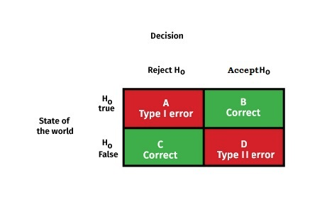
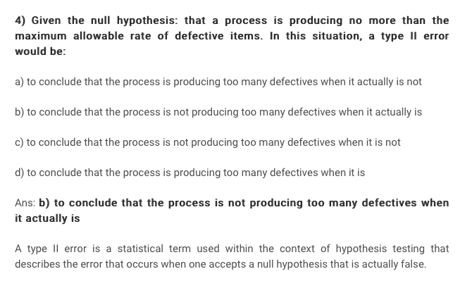
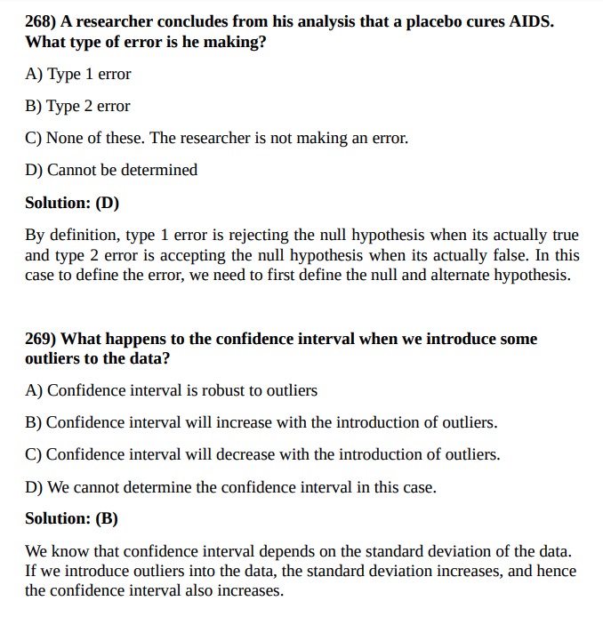

# Introduction
Ref: https://www.csus.edu/indiv/j/jgehrman/courses/stat50/hypthesistests/9hyptest.htm



In hypothesis testing a decision between two alternatives, one of which is called the null hypothesis and the other the alternative hypothesis, must be made. As an example, suppose you are asked to decide whether a coin is fair or biased in favor of heads. In this situation the statement that the coin is fair is the null hypothesis while the statement that the coin is biased in favor of heads is the alternative hypothesis. To make the decision an experiment is performed. For example, the experiment might consist of tossing the coin 10 times, and on the basis of the 10 coin outcomes, you would make a decision either to accept the null hypothesis or reject the null hypothesis (and therefore accept the alternative hypothesis). So, in hypothesis testing acceptance or rejection of the null hypothesis can be based on a decision rule. As an example of a decision rule, you might decide to reject the null hypothesis and accept the alternative hypothesis if 8 or more heads occur in 10 tosses of the coin.

The process of testing hypotheses can be compared to court trials. A person comes into court charged with a crime. A jury must decide whether the person is innocent (null hypothesis) or guilty (alternative hypothesis). Even though the person is charged with the crime, at the beginning of the trial (and until the jury declares otherwise) the accused is assumed to be innocent. Only if overwhelming evidence of the person's guilt can be shown is the jury expected to declare the person guilty--otherwise the person is considered innocent.

# Errors
In the jury trial there are two types of errors: (1) the person is innocent but the jury finds the person guilty, and (2) the person is guilty but the jury declares the person to be innocent. In our system of justice, the first error is considered more serious than the second error.  These two errors along with the correct decisions are shown in the next table where the jury decision is shown in bold on the left margin and the true state of affairs is shown in bold along the top margin of the table.

|  |Truth is Person Innocent  | Truth is Person Guilty |
| :---| :---: | ---: |
| Jury Decides Person Innocent | Correct Decision | Type II Error |
|Jury Decides Person Guilty  | Type I Error |Correct Decision  |


|  | In Fact H0 is True | In Fact H0 is False |
| :---| :---: | ---: |
|Test Decides H0 True  | Correct Decision | Type II Error |
| Test Decides H0 False | Type I Error  |Correct Decision  |

# Assumptions
In a jury trial the person accused of the crime is assumed innocent at the beginning of the trial, and unless the jury can find overwhelming evidence to the contrary, should be judged innocent at the end of the trial. Likewise, in hypothesis testing, the null hypothesis is assumed to be true, and unless the test shows overwhelming evidence that the null hypothesis is not true, the null hypothesis is accepted.

# Type I and II Errors
```
H0: Not producing more defectives
H1: Producing more defectives (Federal Checker wants to test it.)


Type I = False Positive
Reject H0, when H0 is true.
Say producing more defects, when it is not.

Type II = False Negative
Fail to reject H0, when H1 is true.

Say NOT producing more defects, when it is.

```



