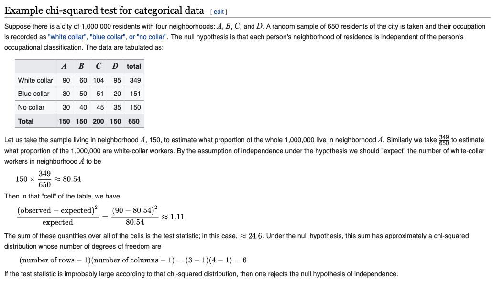

# Images

`Mnemonic: chi sounds like oee`

# Chi-squared Test
```python
import numpy as np
import pandas as pd
import seaborn as sns
import os,sys,time
import scipy
import statsmodels

from scipy import stats
from scipy.stats import ttest_1samp
from scipy.stats import ttest_ind # independent means two samples.
from statsmodels.stats import weightstats as stests # stests.ztest

# contingency table
table = [ [10, 20, 30],
          [6,  9,  17]]

stat, p, dof, expected = stats.chi2_contingency(table)
print('dof=%d' % dof) # dof=2
print('expected values=\n',expected)
expected values=
 [[10.43478261 18.91304348 30.65217391]
 [ 5.56521739 10.08695652 16.34782609]]
print()

# interpret test-statistic
alpha = 0.05
prob = 1 - alpha # 0.95
critical = stats.chi2.ppf(1-alpha, dof)
critical = stats.chi2.ppf(prob, dof)
print('probability=%.3f, critical=%.3f, stat=%.3f' % (prob, critical, stat))
# probability=0.950, critical=5.991, stat=0.272
print()

if abs(stat) >= critical:
    print('Dependent (reject H0)')
else:
    print('Independent (fail to reject H0)')

# Independent (fail to reject H0)
print()

# interpret p-value
alpha = 1.0 - prob
print('significance=%.3f, p=%.3f' % (alpha, p)) # significance=0.050, p=0.873
if p <= alpha:
    print('Dependent (reject H0)')
else:
    print('Independent (fail to reject H0)')

# Independent (fail to reject H0)
```