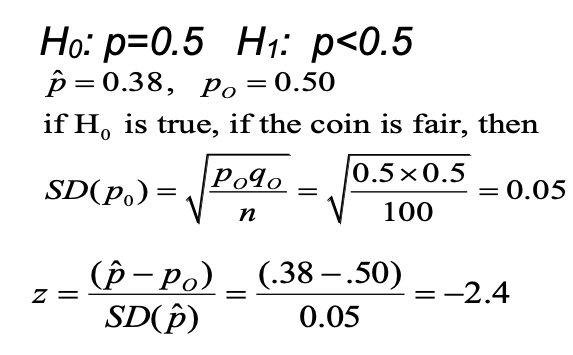
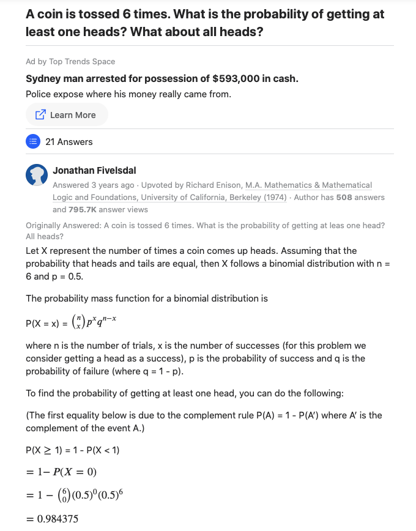
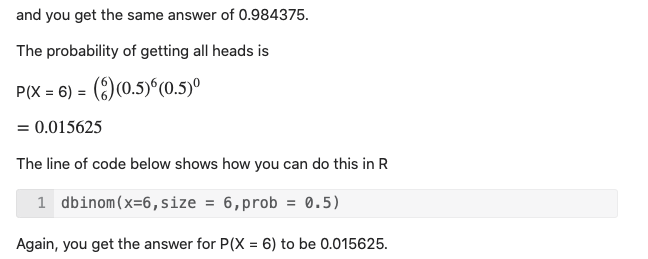
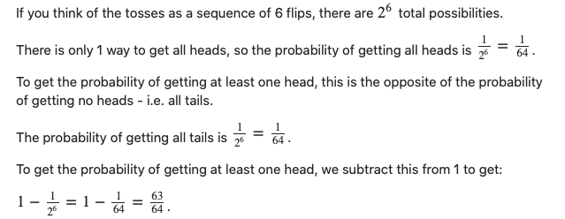
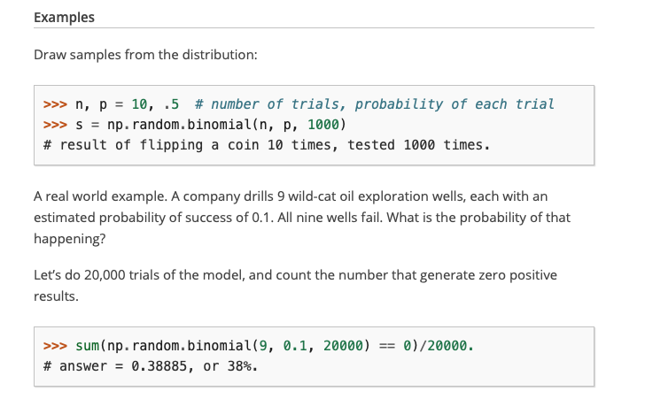
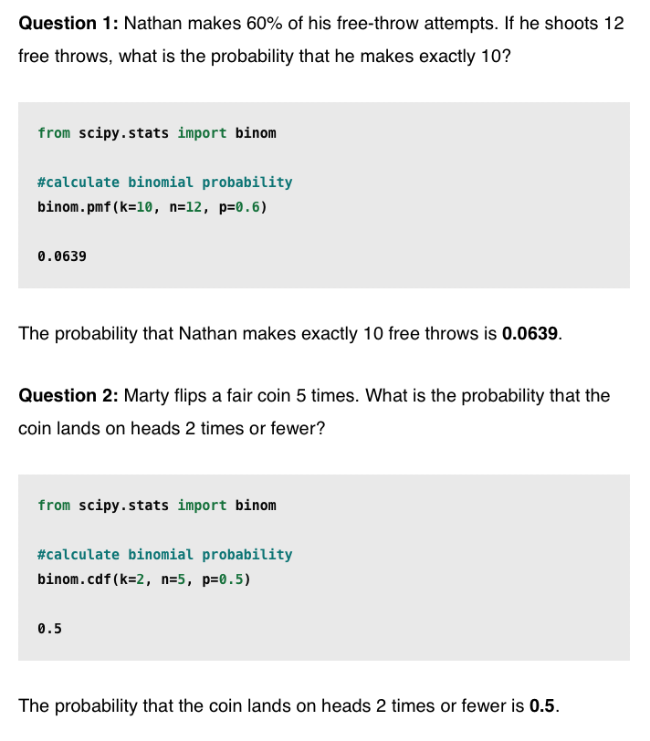
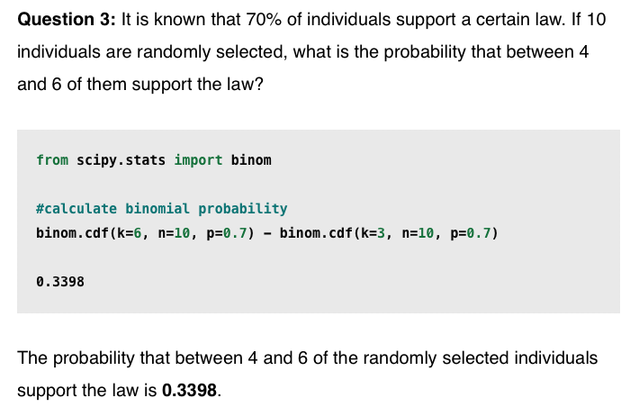

# coin toss


# code
```python
import numpy as np
import pandas as pd
from scipy import stats

p = 0.5
q = 1-p
h = 38
n = 100
p_hat = float(h)/n

std = np.sqrt(p*q/n)
z_score = (p_hat-p)/std

print(f'z_score = {z_score}') # negative means left side of curve.
# z_score = -2.4

p_value = stats.norm.cdf(z_score) # one-sided
print(f"p_value = {p_value:.4f}") # p_value = 0.0082

alpha = 0.01 # 1% significance level alpha  (or, 99% confidence level gamma)

if p_value < alpha:
    print('We reject Null hypothesis that the coin is unbiased.')
    print('The coin is biased towards the tail.')
else:
    print('We fail to reject Null Hypothesis')
    print('We do not have sufficient evidence to say that coin is biased towards tail.')

# We reject Null hypothesis that the coin is unbiased.
# The coin is biased towards the tail.
```

# Questions






