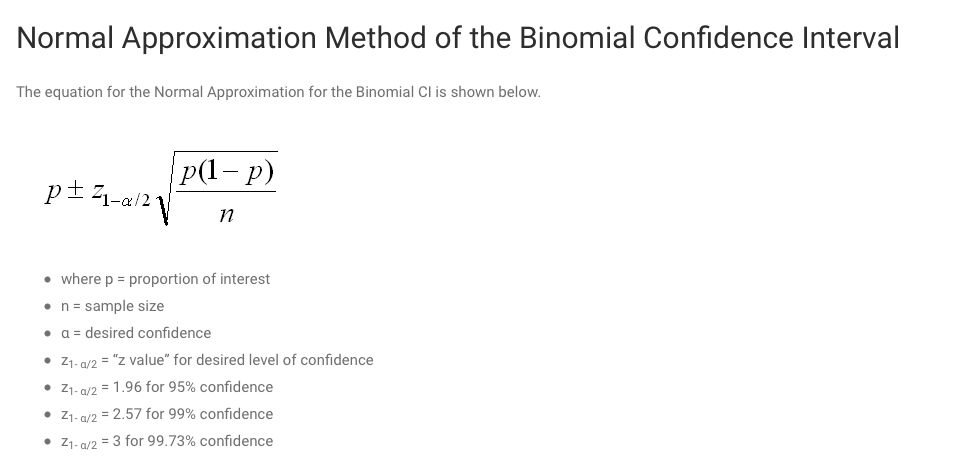
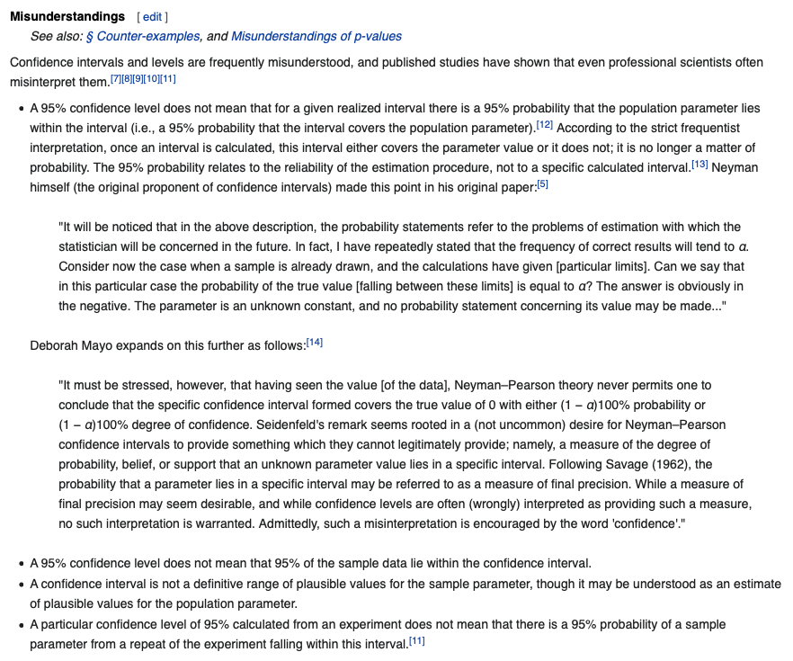
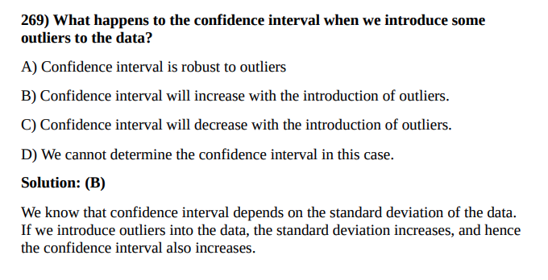
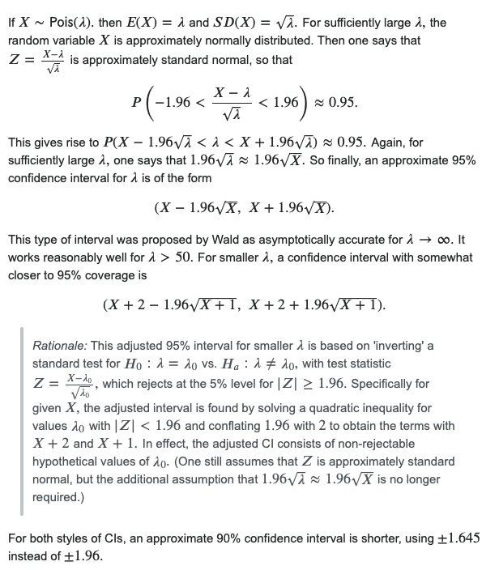
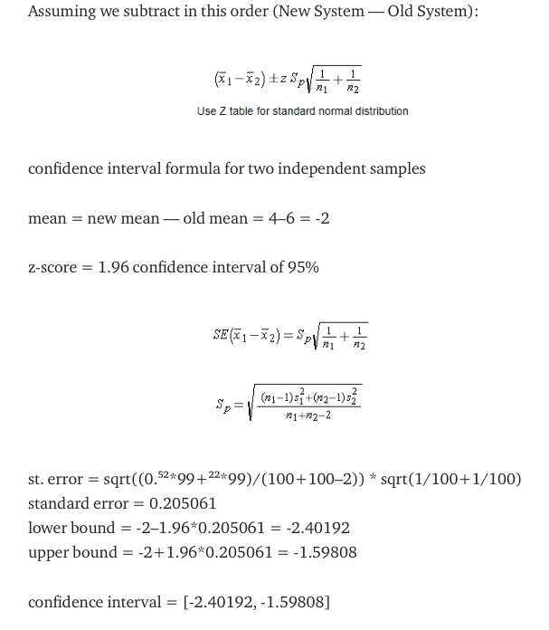
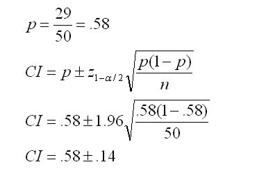
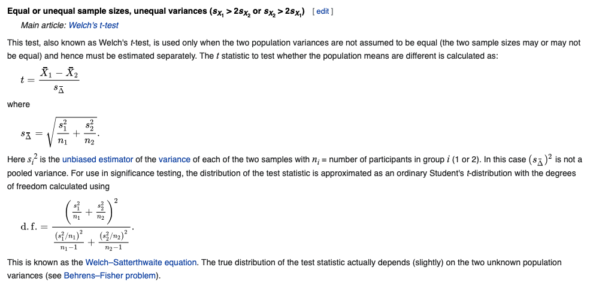
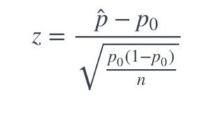
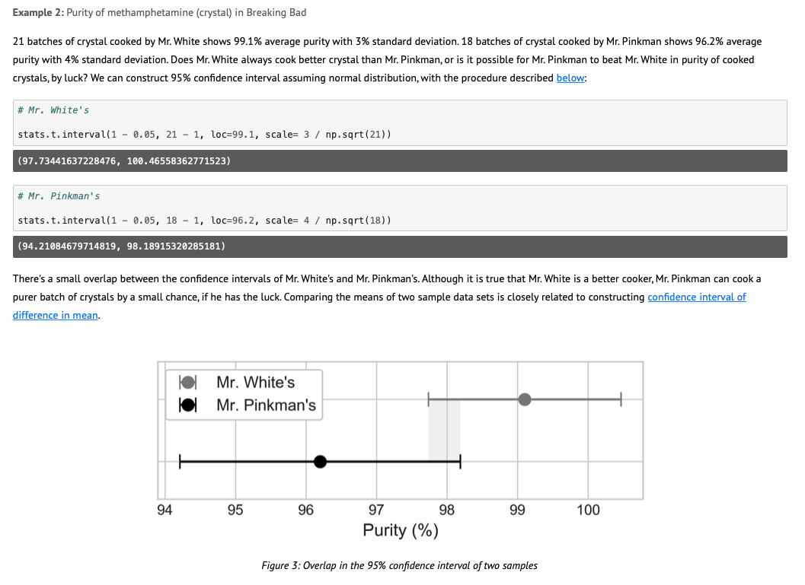

Table of Contents
=================
   * [References](#references)
   * [Confidence interval](#confidence-interval)
   * [Confidence interval using Python vs R](#confidence-interval-using-python-vs-r)
   * [Bootstrapping for confidence interval](#bootstrapping-for-confidence-interval)
   * [Z critical](#z-critical)
   * [Confidence interval for t-distribution](#confidence-interval-for-t-distribution)
   * [Confidence interval for z-distribution](#confidence-interval-for-z-distribution)
   * [Confidence interval example](#confidence-interval-example)
   * [Confidence interval example](#confidence-interval-example-1)
   * [CI using bootstrapping](#ci-using-bootstrapping)
   * [CI using bootstrapping for two groups](#ci-using-bootstrapping-for-two-groups)
   * [Images](#images)
   * [Questions](#questions)


# References
- [scipy stats](https://docs.scipy.org/doc/scipy/reference/generated/scipy.stats.t.html) (Note: in scipy stats t interval alpha actually means confidence level)


# Confidence interval

A confidence interval for a mean is a range of values that is likely to contain a population mean with a certain level of confidence.

It is calculated as:
```python
Confidence Interval = xbar  +/-  t_crit * (s/√n) for small sample size n<30
Confidence Interval = xbar  +/-  z_crit * (s/√n) for larger sample size n>=30

where:

xbar: sample mean
t_crit : t-value that corresponds to the confidence level
z_crit : z-value at corresponds to the confidence level, z_crit = 1.96 for 5% significance level two tailed normal distribution.
s: sample standard deviation (unbiased)
n: sample size
sem = s/sqrt(n) # NOTE: np.std np.nanstd uses biased ddof=0 but stats.sem uses unbiased ddof=1 by default.
```


```
ci = (phat - margin_of_error, phat + margin_of_error)

moe = z_crit * standard_error

z_crit = 1.96 for two-tailed test at 5% significance level.
se = sigma / sqrt(n)

For coin toss:
Z = (phat - p0) / sqrt(p0q0/n)
pval = 1 - stats.norm.cdf(Z)

if pval < alpha:
    Reject Null Hypothesis that coin is unbiased and say it maybe biased.
```


The confidence level tells you how sure you can be and is expressed as a percentage.

- The 95% confidence level means you can be 95% certain.
- The 99% confidence level means you can be 99% certain.


α (Alpha) is called the significance level, and is the probability of rejecting the null hypothesis when it is true.

- It is usually set at or below 5%.
- If your significance level is 0.05, the corresponding confidence level is 95%.

- If your significance level of 0.05, there’s a 5% risk of concluding that a difference exists when there is no actual difference.

# Confidence interval using Python vs R
- [reference](https://stackoverflow.com/questions/28242593/correct-way-to-obtain-confidence-interval-with-scipy)
- [reference](https://stackoverflow.com/questions/15033511/compute-a-confidence-interval-from-sample-data/15034143#15034143)

```python
import numpy as np, scipy.stats as st

# returns confidence interval of mean
def confIntMean(a, conf=0.95):
  mean, sem, m = np.mean(a), st.sem(a), st.t.ppf((1+conf)/2., len(a)-1)
  return mean - m*sem, mean + m*sem

def mean_confidence_interval(data, confidence=0.95):
    a = 1.0 * np.array(data)
    n = len(a)
    m, se = np.mean(a), scipy.stats.sem(a)
    h = se * scipy.stats.t.ppf((1 + confidence) / 2., n-1)
    return m, m-h, m+h

a = np.array([1,2,3,4,4,4,5,5,5,5,4,4,4,6,7,8])

# better method
confIntMean(a, 0.68) # (3.9974214366806184, 4.877578563319382)

# scipy method
st.norm.interval(0.68, loc=np.mean(a), scale=st.sem(a))
#(4.0120010966037407, 4.8629989033962593)

# ====================== Example 02 ============================
# using statsmodels
# https://stackoverflow.com/questions/15033511/compute-a-confidence-interval-from-sample-data/15034143#15034143
import statsmodels.stats.api as sms
sms.DescrStatsW(a).tconfint_mean()

a = list(range(10,14))

mean_confidence_interval(a)
# (11.5, 9.4457397432391215, 13.554260256760879)

st.t.interval(0.95, len(a)-1, loc=np.mean(a), scale=st.sem(a))
# (9.4457397432391215, 13.554260256760879)

# sms.DescrStatsW(a).tconfint_mean()
# (9.4457397432391197, 13.55426025676088)

# And finally, the incorrect result using st.norm.interval():
st.norm.interval(0.95, loc=np.mean(a), scale=st.sem(a))
# (10.23484868811834, 12.76515131188166)
```

# Bootstrapping for confidence interval

```python
import numpy as np
import tqdm
from scipy import stats

alpha = 0.05
a = np.array([1,2,3,4,4,4,5,5,5,5,4,4,4,6,7,8])


reps = 1_000

sample = a # suppose that a is sample drawn from big population
ci_points = [] # point estimate
for _ in tqdm.trange(reps):
    bootsample = np.random.choice(sample, size=len(sample),replace=True)

    # make sure to use bootsample, not sample!
    ci_lo, ci_hi = stats.t.interval(1-alpha,
                                    df = len(bootsample)-1,
                                    loc=np.mean(bootsample),
                                    scale=stats.sem(bootsample))
    ci_point = (ci_lo+ci_hi)/2
    ci_points.append(ci_point)

ci_point = np.mean(ci_points)
ci_lo, ci_hi = np.percentile(ci_points, [alpha/2*100,100-alpha/2*100]) # alpha/2*100 is 2.5
```

# Z critical
```python
import numpy as np
from scipy import stats

# alpha to critical
alpha = 0.05
n_sided = 2 # 2-sided test
z_crit = stats.norm.ppf(1-alpha/n_sided)
print(z_crit) # 1.959963984540054

# critical to alpha
alpha = stats.norm.sf(z_crit) * n_sided
print(alpha) # 0.05
```

# Confidence interval for t-distribution
- [statology](https://www.statology.org/confidence-intervals-python/)
```python
import numpy as np
from scipy scipy import stats

# define sample data
data = [12, 12, 13, 13, 15, 16, 17, 22, 23, 25, 26, 27, 28, 28, 29]

# create 95% confidence interval for population mean weight
# sem is standard error of mean
# significance level alpha = 0.05 and confidence level gamma = 0.95
# even though scipy stats t interval has first parameter called alpha it is 1-alpha
alpha = 0.05
stats.t.interval(1-alpha, df=len(data)-1, loc=np.mean(data), scale=st.sem(data))
# (17.40, 21.08)

# create 99% confidence interval for same sample
alpha = 0.01
stats.norm.interval(1-alpha, loc=np.mean(data), scale=st.sem(data))
# (16.82, 21.66)
# if confidence level is high, confidence level is wider
```

# Confidence interval for z-distribution
- [statology](https://www.statology.org/confidence-intervals-python/)
```python
import numpy as np
import scipy.stats as stats

#define sample data
np.random.seed(0)
data = np.random.randint(10, 30, 50)

#create 95% confidence interval for population mean weight
# significance level alpha = 0.05 and confidence level gamma = 0.95
stats.norm.interval(alpha=0.95, loc=np.mean(data), scale=st.sem(data))
```

# Confidence interval example
- https://vedexcel.com/how-to-calculate-confidence-intervals-in-python/
```python
import numpy as np
from scipy import stats

# define given sample data
data = [45, 55, 67, 45, 68, 79, 98, 87, 84, 82]

# Calculate the sample parameters
significanceLevel   alpha = 0.05          # 5%
confidenceLevel     CL    = 0.95          # 95% CI given
degrees_freedom     df    = len(data)-1   # degree of freedom = sample size-1
sampleMean          xbar  = np.mean(data) # sample mean
sampleStandardError sem   = stats.sem(data,ddof=1)  # sample standard error (default is already ddof=1 unlike numpy)

# create 95% confidence interval for the population mean
# scipy stats interval function has parameter alpha actually equal to 1-alpha
confidenceInterval = stats.t.interval(alpha=confidenceLevel, df=degrees_freedom, loc=sampleMean, scale=sampleStandardError)

# print the 95% confidence interval for the population mean
print('The 95% confidence interval for the population mean :',confidenceInterval)
```

# Confidence interval example
- https://vedexcel.com/how-to-calculate-confidence-intervals-in-python/
```python
import numpy as np
import scipy.stats as st

# define given sample data
data = [87,80,68,72,56,58,60,63,82,70,58,55,48,50,77]

# Calculate the sample parameters
confidenceLevel     = 0.98          # 98% CI given
degrees_freedom     = len(data)-1   # degree of freedom = sample size-1
sampleMean          = np.mean(data) # sample mean
sampleStandardError = st.sem(data)  # sample standard error

#create 98% confidence interval for the population mean
confidenceInterval = st.t.interval(alpha=confidenceLevel, df=degrees_freedom, loc=sampleMean, scale=sampleStandardError)

#print the 98% confidence interval for the population mean
print('The 98% confidence interval for the population mean weight :',confidenceInterval)
```

# CI using bootstrapping
- https://stackoverflow.com/questions/44392978/compute-a-confidence-interval-from-sample-data-assuming-unknown-distribution/66008548#66008548
```python
def bootstrap_ci(
    data,
    statfunction=np.average,
    alpha = 0.05,
    n_samples = 100):

    """inspired by https://github.com/cgevans/scikits-bootstrap"""
    import warnings

    def bootstrap_ids(data, n_samples=100):
        for _ in range(n_samples):
            yield np.random.randint(data.shape[0], size=(data.shape[0],))

    alphas = np.array([alpha/2, 1 - alpha/2])
    nvals = np.round((n_samples - 1) * alphas).astype(int)
    if np.any(nvals < 10) or np.any(nvals >= n_samples-10):
        warnings.warn("Some values used extremal samples; results are probably unstable. "
                      "Try to increase n_samples")

    data = np.array(data)
    if np.prod(data.shape) != max(data.shape):
        raise ValueError("Data must be 1D")
    data = data.ravel()

    boot_indexes = bootstrap_ids(data, n_samples)
    stat = np.asarray([statfunction(data[_ids]) for _ids in boot_indexes])
    stat.sort(axis=0)

    return stat[nvals]

# usage
# simulate some data from a pareto distribution

np.random.seed(33)
data = np.random.pareto(a=1, size=111)
sample_mean = np.mean(data)

plt.hist(data, bins=25)
plt.axvline(sample_mean, c='red', label='sample mean'); plt.legend()

# generate confidence intervals for the SAMPLE MEAN with bootstrapping
low_ci, up_ci = bootstrap_ci(data, np.mean, n_samples=1000)
#plot the resuts

plt.hist(data, bins=25)
plt.axvline(low_ci, c='orange', label='low_ci mean')
plt.axvline(up_ci, c='magenta', label='up_ci mean')
plt.axvline(sample_mean, c='red', label='sample mean'); plt.legend()

#generate confidence intervals for the DISTRIBUTION PARAMETERS with bootstrapping
from scipy.stats import pareto

true_params = pareto.fit(data)
low_ci, up_ci = bootstrap_ci(data, pareto.fit, n_samples=1000)
# low_ci[0] and up_ci[0] are the confidence intervals for the shape param
# low_ci[0], true_params[0], up_ci[0] ---> (0.8786, 1.0983, 1.4599)
```

# CI using bootstrapping for two groups
- https://github.com/SUN-Wenjun/bootstrapping
```python
import numpy as np

def bootstrap_ci_two_groups(df, variable, classes, repetitions = 1000, alpha = 0.05, random_state=None):
    # df: a data frame that includes observations of the two sample
    # variable: the column name of the column that includes observations
    # classes: the column name of the column that includes group assignment (This column should contain two different group names)
    # repetitions: number of times you want the bootstrapping to repeat. Default is 1000.
    # alpha: likelihood that the true population parameter lies outside the confidence interval. Default is 0.05.
    # random_stata: enable users to set their own random_state, default is None.

    df = df[[variable, classes]]
    bootstrap_sample_size = len(df)

    mean_diffs = []

    for i in range(repetitions):
        bootstrap_sample = df.sample(n = bootstrap_sample_size, replace = True, random_state = random_state)
        mean_diff = bootstrap_sample.groupby(classes).mean().iloc[1,0] - bootstrap_sample.groupby(classes).mean().iloc[0,0]
        mean_diffs.append(mean_diff)

    # confidence interval
    left = np.percentile(mean_diffs, alpha/2*100)
    right = np.percentile(mean_diffs, 100-alpha/2*100)

    # point estimate
    point_est = df.groupby(classes).mean().iloc[1,0] - df.groupby(classes).mean().iloc[0,0]

    print('Point estimate of difference between means:', round(point_est,2))
    print((1-alpha)*100,'%','confidence interval for the difference between means:', (round(left,2), round(right,2)))
```

# Images















# Questions





