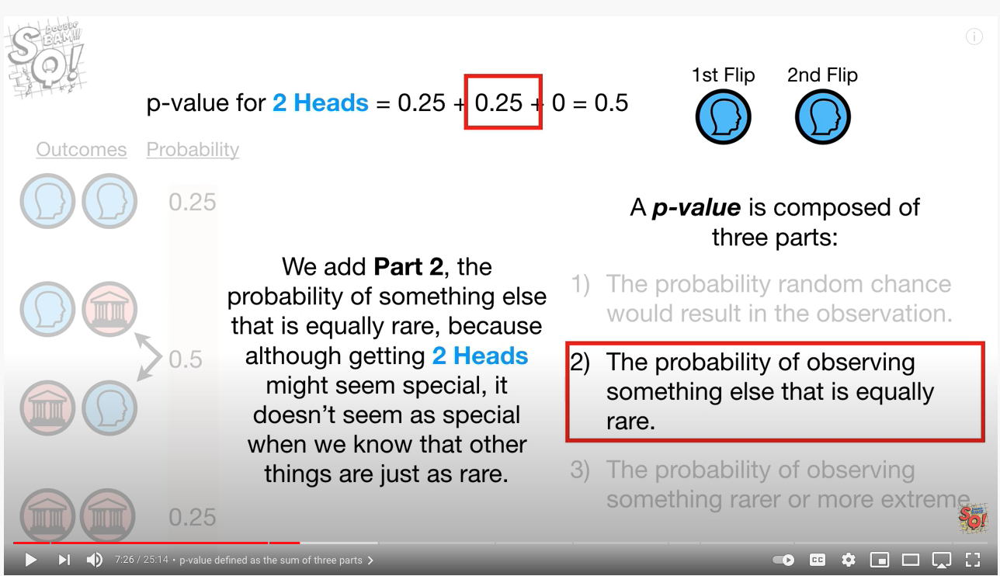
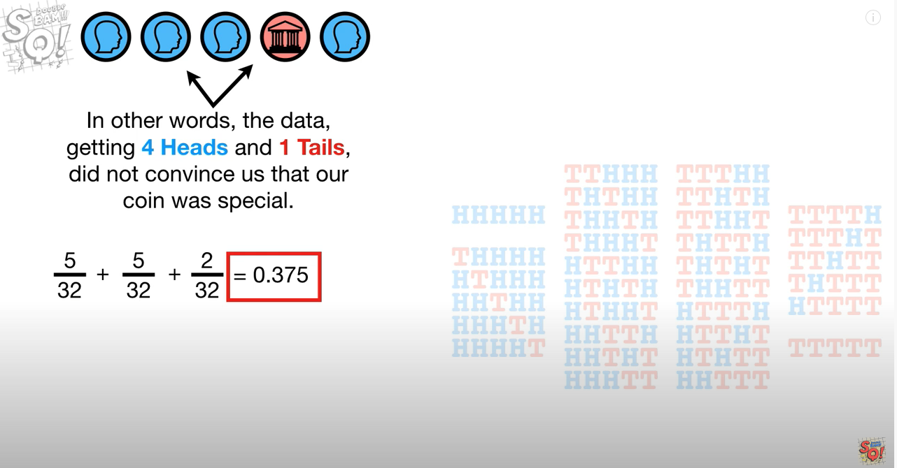

Table of Contents
=================
   * [Hypothesis testing](#hypothesis-testing)
   * [Normal distribution](#normal-distribution)
   * [P-value](#p-value)
   * [When to use Z-test and T-test](#when-to-use-z-test-and-t-test)
   * [One sample t-test](#one-sample-t-test)
   * [Two sampled T-test](#two-sampled-t-test)
   * [Paired sampled t-test](#paired-sampled-t-test)
   * [One-sampled Z-test](#one-sampled-z-test)
   * [Two-sampled Z-test](#two-sampled-z-test)
   * [F-test or ANOVA](#f-test-or-anova)

**Description**  
p-value is the probability value that we select equal or more extreme results from the distribution.
For example, if we toss the coin 5 times and got 4 heads, the p-value is P(4H1T) + P(4T1H) + P(5H) + P(5T) = 5/32 + 5/32 + 1/32 + 1/32 = 12/32 = 0.375. (note 32 = 2^5). The p-value tells how extreme is our result.
We can also get pvalue using binomial test from scipy.
```python
from scipy import stats
from fractions import Fraction
pval = stats.binom_test(x=4, n=5, p=0.5, alternative='two-sided') # 0.375
pval = stats.binom_test(x=[4,1], p=0.5, alternative='two-sided')
pval = stats.binom_test([4,1]) # all rest are defaults

print(Fraction(pval)) # Fraction(3, 8) same as 12/32
# x = int or tuple, tuple means number of success and failures
# if x is tuple, then n is ignored.

note: 4H1T can be placed in 5C4 = 5C1 = 5 ways
THHHH
HTHHH
HHTHH
HHHTH
HHHHT
```

Usually we compare the p-value with the user defined significance level alpha. If p-value is less than alpha, then we reject the null hypothesis and say that we have sufficient evidence to reject the null hypothesis in support of alternative hypothesis.

**NOTES**  
When p-value is less than alpha, we reject the null hypothesis. In other words we have evidence to believe that the sample statistic is significantly different from the population parameter.

**WARNINGS**  
The p-value only says if two groups A and B are different, it does not say how
much different are they? Small p-value does not means they are more different,
if we change sample size even if `%` of effective drug in A, B might be similar,
p-value can be small. This means in linear regression, we can NOT have feature importance based on p-values.

# NOTES
- `scipy.stats` has ttest and binom test but it does not have ztest.
- We need to get ztest from `statsmodels.stats.weightstats as wstats` and then `wstats.ztest`

# Resources
- [Analytics Vidhya: Everything you Should Know about p-value from Scratch for Data Science](https://www.analyticsvidhya.com/blog/2019/09/everything-know-about-p-value-from-scratch-data-science/)

# p-value
The p-value consists of [3 parts](https://www.youtube.com/watch?v=JQc3yx0-Q9E):



# Hypothesis testing
Suppose a pizza place claims their delivery times are 30 minutes
or less on average but you think it’s more than that.
So you conduct a hypothesis test and randomly sample some delivery times to test the claim:

- Null hypothesis — The mean delivery time is 30 minutes or less
- Alternative hypothesis — The mean delivery time is greater than 30 minutes

We’ll use one-tailed test in our case since we only care about if the mean delivery time is greater than 30 minutes.

We use z-test for hypothesis testing:
```
      xbar - mu
z =   -----------
      sigma / sqrt(n)

      phat - p
z = -----------   (phat = h/n and p = 0.5 for fair coin)
    sqrt(pq/n)


z_crit = 1.96 for two-tailed at alpha = 0.05
       = 1.645 for one-tailed

if z > z_crit: Reject H0 (our sample to too outside, it's in insignificant sample)
```

# Normal distribution


# P-value
> The lower the p-value, the more surprising the evidence is, the more ridiculous our null hypothesis looks.

> If the p-value is lower than a predetermined significance level then we reject the null hypothesis.

Now that we’ve collected some sampled delivery times, we perform the calculation and
find that the mean delivery time is longer by 10 minutes with a p-value of 0.03.

What this means is that in a world where the pizza delivery time is 30 minutes or less
(null hypothesis is true), there’s a 3% chance we would see the mean delivery time is
at least 10 minutes longer due to random noise.

The lower the p-value, the more meaningful the result because it is less likely to be caused by noise.
There’s a common misinterpretation of p-value for most people in our case:
The p-value 0.03 means that there’s 3% (probability in percentage)
that the result is due to chance — which is not true.

# When to use Z-test and T-test
When data sample is < 30 samples, use T-test otherwise use z-test.
Some notes:
- Use Z-test when your sample size is greater than 30. Otherwise, use a t test.
- Data points should be independent from each other. In other words, one data point isn’t related or doesn’t affect another data point.
- Your data should be normally distributed. However, for large sample sizes (over 30) this doesn’t always matter.
- Your data should be randomly selected from a population, where each item has an equal chance of being selected.
- Sample sizes should be equal if at all possible.

# One sample t-test
The One Sample t Test determines whether the sample mean is statistically different from a
known or hypothesised population mean. The One Sample t Test is a parametric test.
Example :- you have 50 ages and you are checking whether avg age is 30 or not.
```python
from scipy.stats import ttest_1samp
import numpy as np

x = np.random.randint(20,40,size=(50))
x_mean = np.mean(x)
pop_mean = 30 # declared by researcher
tstat, pval = ttest_1samp(x, pop_mean)
alpha = 0.05

print('data = ', x)
print()
print('mean = ', x_mean)
print('p-value = ', pval)
print('alpha = ', alpha)

if pval < alpha:    # alpha value is 0.05 or 5%
   print(" we reject the null hypothesis")
else:
  print("we accept the null hypothesis")
```

# Two sampled T-test
The Independent Samples t Test or 2-sample t-test compares the means of two independent 
groups in order to determine whether there is statistical evidence that the associated
population means are significantly different. The Independent Samples t Test is a parametric test. This test is also known as: Independent t Test.

Example : is there any association between week1 and week2
```python
import numpy as np
from scipy.stats import ttest_ind
np.random.seed(100)

x1 = np.random.randint(20,40,size=(50)) # randint second number is not included
x2 = np.random.randint(20,40,size=(50)) # here, 40 is NOT included
alpha = 0.05

tstat,pval = ttest_ind(x1,x2)
print("p-value",pval)
if pval <0.05:
  print("we reject null hypothesis")
else:
  print("we accept null hypothesis")

# p-value 0.9045991594475291
# we accept null hypothesis
```

# Paired sampled t-test
The paired sample t-test is also called dependent sample t-test.
It’s an uni-variate test that tests for a significant difference between 2 related variables.
An example of this is if you where to collect the blood pressure for an individual before
and after some treatment, condition, or time point.
> H0 :- means difference between two sample is 0
> H1 :- means difference between two sample is not 0

```python
import numpy as np
from scipy import stats
np.random.seed(100)

x1 = np.random.randint(20,40,size=(50))
x2 = np.random.randint(20,40,size=(50))
alpha = 0.05
tstat,pval = stats.ttest_rel(x1, x2)
print(pval)
if pval<0.05:
    print("reject null hypothesis")
else:
    print("accept null hypothesis")
```

# One-sampled Z-test
- [statsmodels: ztest](https://www.statsmodels.org/stable/generated/statsmodels.stats.weightstats.ztest.html)
```python
from scipy import stats
from statsmodels.stats import weightstats as wstats
np.random.seed(100)

x = np.random.randint(20,40,size=(50)) # weights of mouses

# H0: mean(x1) - value = 0 (two-sided test)
zstat,pval = wstats.ztest(x, x2=None, value=30) # value is population mean
print(float(pval))
if pval< alpha:
    print("reject null hypothesis")
else:
    print("accept null hypothesis")

# 0.4819734873861248
# accept null hypothesis
```

# Two-sampled Z-test
```python
from scipy import stats
from statsmodels.stats import weightstats as wstats
np.random.seed(100)

x1 = np.random.randint(20,40,size=(50)) # blood sugar before
x2 = np.random.randint(20,40,size=(50)) # blood sugar after
alpha = 0.05

# value is difference of mean
zstat,pval = wstats.ztest(x1, x2=x2, value=0,alternative='two-sided')
print('pvalue = ', pval)
if pval< alpha:
    print("We Reject the Null Hypothesis.")
else:
    print("We Accept the Null Hypothesis.")
```

# F-test or ANOVA
When we have more than two groups we use ANOVA test.

# Calculate zscore (standardization)
- https://docs.scipy.org/doc/scipy/reference/generated/scipy.stats.zscore.html
```python
import numpy as np
from scipy import stats

a = np.array([ 0.7972,  0.0767,  0.4383,  0.7866,  0.8091,
               0.1954,  0.6307,  0.6599,  0.1065,  0.0508])

a_normalized = stats.zscore(a)
print(a_normalized)

a_normalized2 = (a - a.mean()) / a.std()
print(a_normalized2) # both are same

ans = [ 1.12724554 -1.2469956  -0.05542642  1.09231569  1.16645923 -0.8558472
  0.57858329  0.67480514 -1.14879659 -1.33234306]
```

# Binomial Test
- https://docs.scipy.org/doc/scipy/reference/generated/scipy.stats.binom_test.html#scipy.stats.binom_test

A car manufacturer claims that no more than 10% of their cars are unsafe. 15 cars are inspected for safety, 3 were found to be unsafe. Test the manufacturer’s claim:

```python
import numpy as np
from scipy import stats

alpha = 0.05
pval = stats.binom_test(4, n=5, p=0.5, alternative='two-sided')

print('pvalue = ', pval) # 0.375
if pval< alpha:
    print("We Reject the Null Hypothesis.")
else:
    print("We Accept the Null Hypothesis.")

# pvalue =  0.375
# We Accept the Null Hypothesis.

# p-value = P(4H1T) + P(4T1H) + P(5H) + P(5T)
pval2 = 5/32 + 5/32 + 1/32 + 1/32
print(pval2) # 0.375
```

# Scipy normaltest (D’Agostino and Pearson’s test for normality)
`scipy` does not have ztest but it has some normality test. The default
normal test function uses D'Agostino test.

- https://docs.scipy.org/doc/scipy/reference/generated/scipy.stats.normaltest.html#scipy.stats.normaltest

```python
import numpy as np
from scipy import stats
np.random.seed(28041990)

N = 1000
a = np.random.normal(0, 1, size=N)
b = np.random.normal(2, 1, size=N)

x = np.concatenate((a, b))
k2, p = stats.normaltest(x)

alpha = 0.001 # 1e-3 is 0.1%
print("p = {:g}".format(p))

if p < alpha:  # null hypothesis: x comes from a normal distribution
    print("The null hypothesis can be rejected")
else:
    print("The null hypothesis cannot be rejected")

# p = 3.27207e-11
# The null hypothesis can be rejected
```