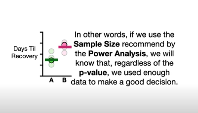
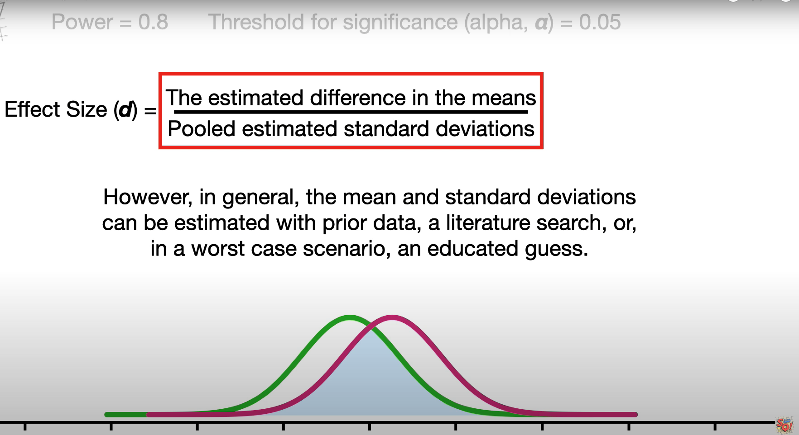

# Resources
- [statquest: Power Analysis, Clearly Explained!!!](https://www.youtube.com/watch?v=VX_M3tIyiYk&t=667s)

# Power Analysis
Let's say we have two drugs A and B with 5 samples each. The t-test for means gives us pvalue = 0.06.
But the y-axis (recovery days) for drug A looks smaller and we want to add more points to get lower p-value. This is p-hacking, we should not do this. Instead, we should do power analysis to find the large enough sample size. The power gives, regardless of p-value, we have enough information to make a good decision.

Power is affected by: a) Overlap between distributions b) Sample size.





If we have more-overlap, we need more samples to have more power.
Even when the distributions overlap, the sample means become separated if we have large enough sample size.


# Statistical Power
This is the probability of rejecting null hypothesis when alternative hypothesis is true.

Power = 1 - Type II Error

Higher the statistical power, lower is the probability of making type II error.

If statistic power is low: Large risk of committing type II error. (FN)

If statistic power is large: Small risk of type II error.


NOTE:
Type I error: Reject H0 when H0 is true. FP. p-value is optimistically low.

Type II error: Fail to reject H0 when H1 is true. False NEGATIVE.

# Sample size
Usually we use power analysis to get the sample size required for a study.

```python
# estimate sample size via power analysis
from statsmodels.stats.power import TTestIndPower
# parameters for power analysis
effect_size_d = 0.8
alpha = 0.05
power = 0.8

# perform power analysis
analysis = TTestIndPower()
sample_size = analysis.solve_power(effect_size_d, power=power,
                     nobs1=None, ratio=1.0, alpha=alpha)
print('Sample Size: %d' % int(sample_size)) # Sample Size: 25
```

An effect size refers to the size or magnitude of an effect or result as it would be expected to occur in a population.

The effect size is estimated from samples of data.

Usually effect size is taken as Pearson Correlation r or cohen's d measurement.