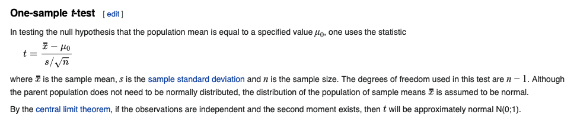
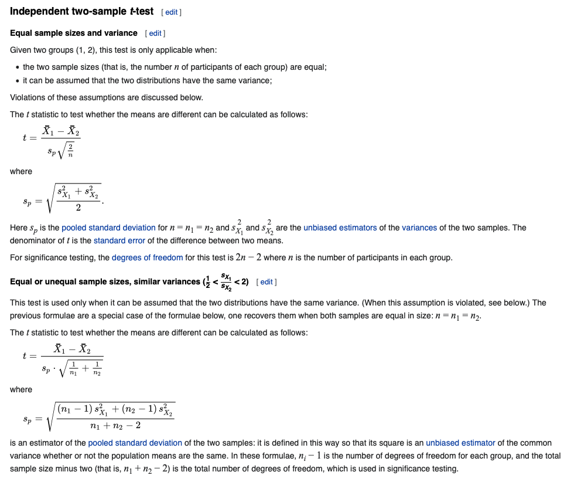
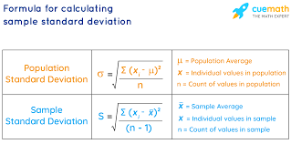
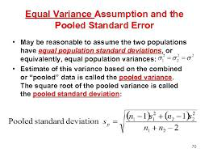
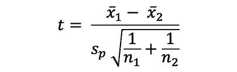

# What is t-test?
The `t-test` (also called `Student’s T Test`) compares two averages (means)
and tells you if they are different from each other.
The `t-test` also tells you how significant the differences are.
In other words it lets you know if those differences could have happened by chance.

# What is t-score?
- The `t-score` is a ratio between the difference between two groups and the
difference within the groups.
- The larger the `t-score`, the more difference there is between groups.
- The smaller the `t-score`, the more similarity there is between groups.
- A `t-score` of 3 means that the groups are three times as different from each
other as they are within each other. When you run a `t-test`,
the bigger the `t-value`, the more likely it is that the results are repeatable.
- A large `t-score` tells you that the groups are different.
- A small `t-score` tells you that the groups are similar.

# What are T-Values and P-values?
- A `p-value` is the probability that the results from your sample data occurred by chance.
- P-values are from 0% to 100%. They are usually written as a decimal.
For example, a `p-value` of 5% is 0.05.
- Low `p-values` are good. They indicate your data did not occur by chance.
- For example, a `p-value` of .01 means there is only a 1% probability that the results
from an experiment happened by chance.
In most cases, a `p-value` of 0.05 (5%) is accepted to mean the data is valid.

# Types of t-tests?
There are three main types of `t-test`:
1. An Independent Samples `t-test` compares the means for two groups.
2. A Paired sample `t-test` compares means from the same group at different
times (say, one year apart).
3. A One sample `t-test` tests the mean of a single group against a known mean.




Lets us say we have to test whether the height of men in the population
is different from height of women in general.
So we take a sample from the population and use the
`t-test` to see if the result is significant.

# Setps of 2 sample t-test
1. Determine a null and alternate hypothesis.
In general, the null hypothesis will state that the two populations being
tested have no statistically significant difference.
The alternate hypothesis will state that there is one present.
In this example we can say that:

  + Null Hypothesis: Height of men \& women are the same
  + Alternate Hypothesis: Height of men \& women are the different

2. Collect sample data
Next step is to collect data for each population group.
In our example we will collect 2 sets of data, one with the height of women
and one with the height of men.The sample size should ideally be the same but
it can be different. Lets say that the sample sizes are nx and ny.

3. Determine a confidence interval and degrees of freedom
This is what we call alpha (α). The typical value of α is 0.05.
This means that there is 95% confidence that the conclusion of this test will be valid.
The degree of freedom can be calculated by the the following formula:
`df = nx + ny -2`

4. Calculate the t-statistic
[t-statistic](https://en.wikipedia.org/wiki/Student%27s_t-test) can be calculated using the below formula
```
     xbar - mu
t = ------------
         s
where, s = sigmahat / sqrt(n)

Note:
sigma = sqrt(  (xi-mu)**2 /n )
s     = sqrt(  (xi-xbar)**2 / (n-1)   )


For equal size:

t = x1bar - x2bar
    --------------
    sp * sqrt(2/n)

where, pooled standard deviation,
sp =          s1^2 + s2^2
      sqrt ( -------------- )
                  2


for unequal sizes,
t = x1bar - x2bar
    ---------------
    sp * sqrt(1/n1 + 1/n2)

with,
                 (n1-1) s1^2 + (n2-1) s2^2
sp =  sqrt ( ------------------------------  )
                      n1 + n2 - 1
```

5. Calculate the critical `t-value` from the t distribution
To calculate the critical `t-value`, we need 2 things,
the chosen value of alpha and the degrees of freedom.
The formula of `critical t-value `is complex but it is fixed for a
fixed pair of degree of freedom and value of alpha.
We therefore use a table to calculate the critical t-value:

6. Compare the critical `t-values` with the calculated t statistic
If the calculated `t-statistic` is greater than the `critical t-value`,
the test concludes that there is a statistically significant difference
between the two populations. Therefore, you reject the null hypothesis
that there is no statistically significant difference between the two populations.
In any other case, there is no statistically significant difference between
the two populations.
The test fails to reject the null hypothesis and we accept the alternate
hypothesis which says that the height of men and women are statistically different.

# Code
```python
## Import the packages
import numpy as np
from scipy import stats


## Define 2 random distributions
#Sample Size
N = 10
#Gaussian distributed data with mean = 2 and var = 1
a = np.random.randn(N) + 2
#Gaussian distributed data with with mean = 0 and var = 1
b = np.random.randn(N)


## Calculate the Standard Deviation
#Calculate the variance to get the standard deviation

#For unbiased max likelihood estimate we have to divide the var by N-1, and therefore the parameter ddof = 1
var_a = a.var(ddof=1)
var_b = b.var(ddof=1)

#std deviation
s = np.sqrt((var_a + var_b)/2)

## Calculate the t-statistics
t = (a.mean() - b.mean())/(s*np.sqrt(2/N))

## Compare with the critical t-value
#Degrees of freedom
df = 2*N - 2

#p-value after comparison with the t
p = 1 - stats.t.cdf(t,df=df)

print("t = " + str(t))
print("p = " + str(2*p))
### You can see that after comparing the t statistic with the critical t value (computed internally) we get a good p value of 0.0005 and thus we reject the null hypothesis and thus it proves that the mean of the two distributions are different and statistically significant.

## Cross Checking with the internal scipy function
t2, p2 = stats.ttest_ind(a,b)
print("t = " + str(t2))
print("p = " + str(p2))

t = 4.931847480061103
p = 0.00010762101193573237
t = 4.931847480061102
p = 0.00010762101193561383

# NOTE: calculation of critical t-value (ind means independent)
t_val = ststs.t.ppf([0.975], df)
```

# One sample t-test
```python
import numpy as np
from scipy import stats

sample = np.arange(1,10) # [1,2,3,...,9]

confidence_level = 0.95 # alpha = 0.05
degrees_freedom = sample.size - 1
sample_mean = np.mean(sample)
sample_standard_error = stats.sem(sample)

confidence_interval = stats.t.interval(confidence_level, degrees_freedom,
                      loc = sample_mean, scale = sample_standard_error)

print(confidence_interval) # (2.8949158625700564, 7.105084137429944)
```

Another example
```python
from scipy import stats
import numpy as np

np.random.seed(42)

arr = np.random.normal(loc=74, scale=4.3, size=20)

alpha = 0.05                       # significance level = 5%
df = len(arr) - 1                  # degrees of freedom = 20
t = stats.t.ppf(1 - alpha/2, df)   # t-critical value for 95% CI = 2.093
s = np.std(arr, ddof=1)            # sample standard deviation = 2.502
n = len(arr)

lower = np.mean(arr) - (t * s / np.sqrt(n))
upper = np.mean(arr) + (t * s / np.sqrt(n))
```

# Formulas


