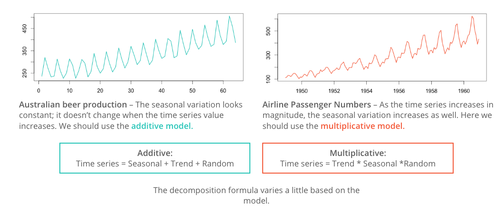

# Additive vs multiplicative decomposition
Time series STL components:
- Seasonality: is the repeating the short-term cycle in the series.
- Trend: is the increasing or decreasing value in the series.
- Level: is the average value in the series.
- Noise: is the random variation in the series.

```
# The Additive Model
y(t) = Level + Trend + Seasonality + Noise

# The Multiplicative Model
y(t) = Level * Trend * Seasonality * Noise
```



# decomposition
```python
from statsmodels.tsa.seasonal import seasonal_decompose

decomp = seasonal_decompose(y, model=’additive’)
fig = decomp.plot()
fig.set_figheight(8)
fig.set_figwidth(12)


# This gives four parts

1. decomp.observed
2. decomp.trend
3. decomp.seasonal
4. decomp.resid
```
